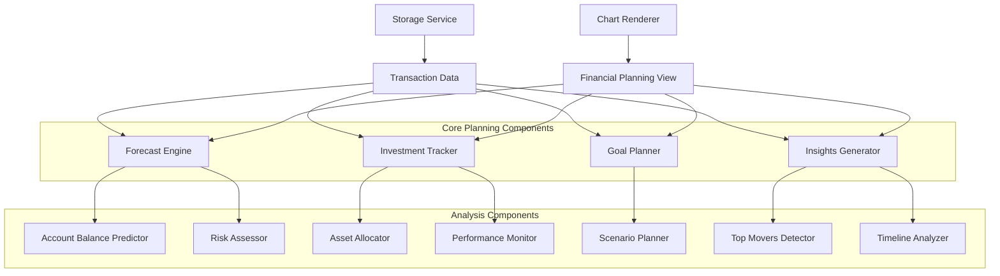
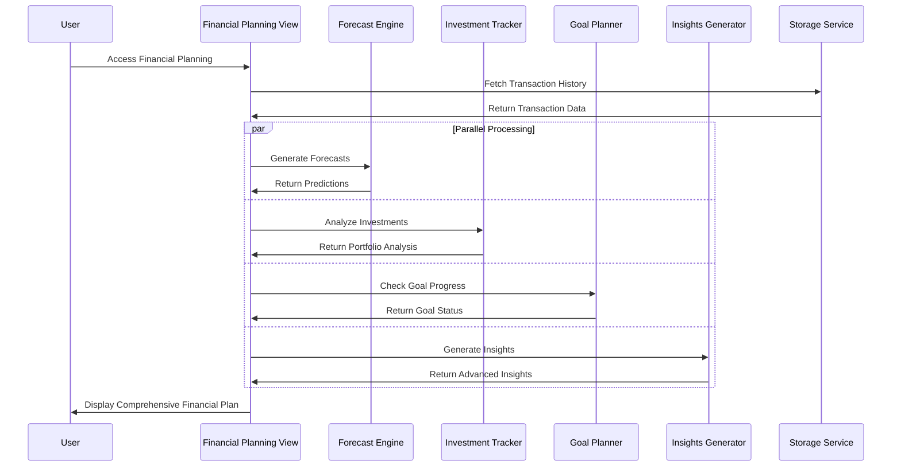

# Design Document: Advanced Financial Planning

## Overview

The Advanced Financial Planning feature transforms BlinkBudget into a comprehensive financial planning platform by adding sophisticated forecasting, investment tracking, goal planning, and advanced analytics capabilities. This feature leverages existing transaction data and extends the application with predictive analytics, risk assessment, and long-term financial modeling.

The design emphasizes practical, implementable algorithms that provide accurate insights without requiring complex machine learning infrastructure. The system uses proven statistical methods like exponential smoothing and moving averages for forecasting, combined with rule-based risk assessment and goal tracking algorithms.

## Architecture

### High-Level Architecture



### Data Flow Architecture



## Components and Interfaces

### 1. Forecast Engine (`src/core/forecast-engine.js`)

**Purpose:** Generates financial forecasts using statistical methods optimized for personal finance data.

**Key Methods:**
```javascript
class ForecastEngine {
  // Core forecasting methods
  generateIncomeForecasts(transactions, months = 12)
  generateExpenseForecasts(transactions, months = 12)
  detectSeasonalPatterns(transactions)
  calculateConfidenceIntervals(forecasts, historicalVariance)
  
  // Forecasting algorithms
  exponentialSmoothing(timeSeries, alpha = 0.3)
  movingAverage(timeSeries, windowSize = 3)
  trendAnalysis(timeSeries)
  
  // Recurring transaction detection
  identifyRecurringTransactions(transactions)
  predictRecurringAmounts(recurringTransactions)
}
```

**Forecasting Algorithm Selection:**
Based on research, the system will use a hybrid approach:

1. **Exponential Smoothing (Primary):** For general income/expense forecasting
   - Gives more weight to recent data points
   - Adapts quickly to changing patterns
   - Formula: `S_t = α * X_t + (1-α) * S_{t-1}`
   - Default α = 0.3 for personal finance (balances responsiveness with stability)

2. **Moving Average (Secondary):** For smoothing volatile categories
   - Simple 3-month moving average for trend identification
   - Used for categories with high variance

3. **Recurring Transaction Detection:** For high-confidence predictions
   - Pattern matching for monthly/weekly recurring transactions
   - Separate handling for fixed vs. variable recurring amounts

### 2. Account Balance Predictor (`src/core/account-balance-predictor.js`)

**Purpose:** Projects future account balances and identifies potential financial risks.

**Key Methods:**
```javascript
class AccountBalancePredictor {
  // Balance projection
  projectBalances(currentBalance, incomeForecasts, expenseForecasts, months = 6)
  calculateCashFlow(incomeForecasts, expenseForecasts)
  
  // Risk detection
  identifyLowBalanceRisks(balanceProjections, thresholds)
  detectOverdraftRisks(balanceProjections)
  assessCreditLimitRisks(balanceProjections, creditLimits)
  
  // Scenario modeling
  modelWhatIfScenarios(baseProjections, scenarioAdjustments)
}
```

### 3. Investment Tracker (`src/core/investment-tracker.js`)

**Purpose:** Manages investment portfolio data and provides analysis capabilities.

**Key Methods:**
```javascript
class InvestmentTracker {
  // Portfolio management
  addInvestment(symbol, shares, purchasePrice, purchaseDate)
  updateInvestmentValue(symbol, currentPrice)
  removeInvestment(symbol)
  
  // Analysis methods
  calculatePortfolioValue(investments)
  calculateGainsLosses(investments)
  calculateReturns(investments, timePeriod)
  
  // Asset allocation
  analyzeAssetAllocation(investments)
  analyzeSectorAllocation(investments)
  analyzeGeographicAllocation(investments)
}
```

**Investment Data Structure:**
```javascript
const investment = {
  id: string,
  symbol: string,
  name: string,
  shares: number,
  purchasePrice: number,
  currentPrice: number,
  purchaseDate: Date,
  assetClass: 'stock' | 'bond' | 'etf' | 'mutual_fund' | 'real_estate',
  sector: string,
  region: string
}
```

### 4. Goal Planner (`src/core/goal-planner.js`)

**Purpose:** Manages long-term financial goals and tracks progress toward achievement.

**Key Methods:**
```javascript
class GoalPlanner {
  // Goal management
  createGoal(name, targetAmount, targetDate, currentSavings = 0)
  updateGoalProgress(goalId, newSavings)
  deleteGoal(goalId)
  
  // Progress calculation
  calculateRequiredMonthlySavings(goal)
  calculateGoalProgress(goal)
  assessGoalFeasibility(goal, projectedIncome, projectedExpenses)
  
  // Long-term modeling
  projectWealthAccumulation(savingsRate, investmentReturn, years)
  modelRetirementNeeds(currentAge, retirementAge, desiredIncome)
}
```

**Goal Data Structure:**
```javascript
const financialGoal = {
  id: string,
  name: string,
  type: 'retirement' | 'house' | 'education' | 'emergency_fund' | 'custom',
  targetAmount: number,
  targetDate: Date,
  currentSavings: number,
  monthlyContribution: number,
  priority: 'high' | 'medium' | 'low',
  createdDate: Date
}
```

### 5. Insights Generator (`src/core/insights-generator.js`)

**Purpose:** Creates advanced financial insights and recommendations based on data analysis.

**Key Methods:**
```javascript
class InsightsGenerator {
  // Top movers analysis
  analyzeTopMovers(currentPeriod, previousPeriod)
  calculateCategoryChanges(currentData, previousData)
  identifySignificantChanges(changes, threshold = 0.15)
  
  // Timeline analysis
  generateTimelineComparison(periods)
  identifyTrends(timelineData)
  detectSeasonalPatterns(timelineData)
  
  // Insight generation
  generateSpendingInsights(analysisResults)
  generateIncomeInsights(analysisResults)
  generateSavingsInsights(analysisResults)
  
  // Recommendation engine
  generateActionableRecommendations(insights, userProfile)
}
```

### 6. Risk Assessor (`src/core/risk-assessor.js`)

**Purpose:** Evaluates financial risks and provides warnings and recommendations.

**Key Methods:**
```javascript
class RiskAssessor {
  // Risk evaluation
  assessEmergencyFundAdequacy(monthlyExpenses, emergencyFund)
  evaluateDebtToIncomeRatio(monthlyDebt, monthlyIncome)
  analyzeSpendingTrends(expenseHistory)
  
  // Warning generation
  generateLowBalanceWarnings(balanceProjections)
  generateDebtWarnings(debtAnalysis)
  generateInvestmentRiskWarnings(portfolioAnalysis)
  
  // Risk scoring
  calculateOverallRiskScore(riskFactors)
  prioritizeRisks(riskAssessments)
}
```

### 7. Financial Planning View (`src/views/FinancialPlanningView.js`)

**Purpose:** Main interface for accessing all financial planning features.

**Key Methods:**
```javascript
class FinancialPlanningView {
  // View lifecycle
  render()
  mount()
  unmount()
  
  // Section management
  renderForecastSection()
  renderInvestmentSection()
  renderGoalsSection()
  renderInsightsSection()
  
  // User interactions
  handleTimeRangeChange(newRange)
  handleGoalCreation(goalData)
  handleInvestmentAddition(investmentData)
  handleScenarioModeling(scenarioParams)
  
  // Data loading and updates
  loadPlanningData()
  refreshForecasts()
  updateGoalProgress()
}
```

## Data Models

### Forecast Data Models

```javascript
// Income/Expense forecast
const forecast = {
  period: Date,
  predictedAmount: number,
  confidenceInterval: {
    lower: number,
    upper: number
  },
  confidence: number, // 0-1 scale
  method: 'exponential_smoothing' | 'moving_average' | 'recurring',
  seasonalFactor: number
}

// Seasonal pattern
const seasonalPattern = {
  category: string,
  monthlyMultipliers: number[], // 12 values, one per month
  strength: number, // How strong the seasonal pattern is
  confidence: number
}
```

### Investment Data Models

```javascript
// Portfolio summary
const portfolioSummary = {
  totalValue: number,
  totalGainLoss: number,
  totalReturn: number,
  assetAllocation: {
    stocks: number,
    bonds: number,
    etfs: number,
    mutualFunds: number,
    realEstate: number,
    cash: number
  },
  sectorAllocation: Map<string, number>,
  geographicAllocation: Map<string, number>
}

// Performance metrics
const performanceMetrics = {
  period: string,
  return: number,
  volatility: number,
  sharpeRatio: number,
  maxDrawdown: number,
  benchmarkComparison: number
}
```

### Goal Planning Data Models

```javascript
// Goal progress
const goalProgress = {
  goalId: string,
  currentProgress: number, // 0-1 scale
  projectedCompletionDate: Date,
  requiredMonthlySavings: number,
  onTrack: boolean,
  recommendations: string[]
}

// Wealth projection
const wealthProjection = {
  year: number,
  projectedWealth: number,
  savingsContribution: number,
  investmentGrowth: number,
  inflationAdjusted: number
}
```

### Insights Data Models

```javascript
// Top mover analysis
const topMover = {
  category: string,
  absoluteChange: number,
  percentageChange: number,
  direction: 'increase' | 'decrease',
  significance: 'high' | 'medium' | 'low',
  explanation: string
}

// Timeline comparison
const timelineComparison = {
  period: string,
  income: number,
  expenses: number,
  netSavings: number,
  changeFromPrevious: {
    income: number,
    expenses: number,
    netSavings: number
  },
  trend: 'improving' | 'declining' | 'stable'
}
```

## Technology Decisions

### Forecasting Algorithm Implementation

**Exponential Smoothing Implementation:**
```javascript
exponentialSmoothing(data, alpha = 0.3) {
  if (data.length === 0) return [];
  
  const smoothed = [data[0]];
  for (let i = 1; i < data.length; i++) {
    smoothed[i] = alpha * data[i] + (1 - alpha) * smoothed[i - 1];
  }
  return smoothed;
}
```

**Confidence Interval Calculation:**
Based on historical variance and forecast horizon:
```javascript
calculateConfidenceInterval(forecast, historicalVariance, horizon) {
  const standardError = Math.sqrt(historicalVariance * (1 + horizon * 0.1));
  return {
    lower: forecast - 1.96 * standardError,
    upper: forecast + 1.96 * standardError
  };
}
```

### Investment Data Management

**Manual Entry Approach:**
Given BlinkBudget's focus on simplicity and the complexity of real-time market data integration, the initial implementation will use manual investment entry. This approach:

1. **Reduces Complexity:** No need for market data APIs or real-time updates
2. **Maintains Privacy:** No external data sharing required
3. **User Control:** Users input only what they want to track
4. **Cost Effective:** No subscription fees for market data

**Future Enhancement Path:**
The architecture supports future integration with market data APIs for automatic price updates.

### Performance Optimizations

1. **Calculation Caching:** Cache forecast results and invalidate when new transactions are added
2. **Incremental Updates:** Update only affected calculations when data changes
3. **Background Processing:** Use Web Workers for complex calculations (future enhancement)
4. **Data Pagination:** Load historical data in chunks for large datasets

## Error Handling

### Data Quality Issues
- **Insufficient Historical Data:** Require minimum 3 months for forecasting, show warnings for less
- **Irregular Transaction Patterns:** Use wider confidence intervals and provide disclaimers
- **Missing Investment Data:** Graceful degradation with partial portfolio analysis
- **Invalid Goal Parameters:** Validation with helpful error messages

### Calculation Errors
- **Division by Zero:** Handle edge cases in percentage calculations
- **Negative Forecasts:** Floor predictions at zero with explanatory notes
- **Extreme Values:** Cap forecasts at reasonable bounds based on historical data
- **Date Calculation Errors:** Robust date handling for goal timelines

### User Experience Errors
- **Complex Interface:** Progressive disclosure of advanced features
- **Information Overload:** Prioritize most important insights and recommendations
- **Mobile Performance:** Optimize calculations and rendering for mobile devices
- **Accessibility:** Ensure all charts and data are accessible via screen readers

### Recovery Strategies
```javascript
// Example error handling for forecasting
generateForecast(data) {
  try {
    if (data.length < 3) {
      return this.generateBasicForecast(data);
    }
    return this.generateAdvancedForecast(data);
  } catch (error) {
    console.error('Forecast generation failed:', error);
    return this.getFallbackForecast();
  }
}
```

## Testing Strategy

The Advanced Financial Planning feature requires comprehensive testing to ensure accuracy of financial calculations and reliability of predictions. The testing approach combines unit tests for specific calculations with property-based tests for universal mathematical properties.

### Dual Testing Approach

**Unit Tests:**
- Specific examples demonstrating correct behavior
- Edge cases and error conditions
- Integration points between components
- Known calculation scenarios with expected results

**Property-Based Tests:**
- Universal properties that hold for all inputs
- Mathematical relationships that must always be true
- Comprehensive input coverage through randomization
- Minimum 100 iterations per property test

### Property-Based Testing Configuration

The system will use a JavaScript property-based testing library (such as fast-check) to implement the correctness properties. Each property test will:

- Run a minimum of 100 iterations with randomized inputs
- Reference its corresponding design document property
- Use the tag format: **Feature: advanced-financial-planning, Property {number}: {property_text}**
- Validate universal mathematical and logical relationships

### Testing Focus Areas

**Financial Calculation Accuracy:**
- Forecast calculations must be mathematically correct
- Investment returns and portfolio values must sum correctly
- Goal progress calculations must reflect actual savings rates

**Data Consistency:**
- All calculations using the same input data must be consistent
- Time period changes must update all related calculations
- Cache invalidation must maintain data accuracy

**User Interface Behavior:**
- All interactive elements must respond correctly to user input
- Data visualizations must accurately represent underlying calculations
- Error states must provide helpful guidance to users

## Correctness Properties

*A property is a characteristic or behavior that should hold true across all valid executions of a system—essentially, a formal statement about what the system should do. Properties serve as the bridge between human-readable specifications and machine-verifiable correctness guarantees.*

### Core Properties

**Property 1: Forecast Calculation Accuracy**
*For any* transaction dataset with at least 3 months of history, generating forecasts should produce mathematically correct predictions where the forecast values are based on the chosen algorithm (exponential smoothing, moving average, or recurring pattern detection) and confidence intervals reflect historical variance
**Validates: Requirements 1.1, 1.2, 1.3, 1.4**

**Property 2: Balance Projection Mathematical Correctness**
*For any* starting balance and forecast data, projected account balances should equal the starting balance plus the cumulative sum of forecasted net cash flows (income minus expenses) for each period
**Validates: Requirements 2.1, 2.5**

**Property 3: Investment Calculation Accuracy**
*For any* investment portfolio, the current value should equal shares multiplied by current price, gains/losses should equal current value minus purchase value, and percentage returns should equal gains/losses divided by purchase value
**Validates: Requirements 3.2, 3.5**

**Property 4: Asset Allocation Mathematical Consistency**
*For any* investment portfolio, the sum of all asset class percentages should equal 100%, sector allocation percentages should sum to 100%, and geographic allocation percentages should sum to 100%, with each percentage calculated as (category value / total portfolio value) * 100
**Validates: Requirements 3.3, 3.4**

**Property 5: Goal Progress Calculation Accuracy**
*For any* financial goal, the required monthly savings should equal (target amount - current savings) divided by months remaining, and progress percentage should equal (current savings / target amount) * 100
**Validates: Requirements 4.2, 4.3**

**Property 6: Top Movers Analysis Mathematical Correctness**
*For any* two time periods being compared, absolute change should equal current period amount minus previous period amount, percentage change should equal (absolute change / previous period amount) * 100, and the top 5 categories should be those with the largest absolute changes
**Validates: Requirements 5.1, 5.2, 5.3**

**Property 7: Timeline Calculation Consistency**
*For any* selected time period, the sum of all monthly income values should equal total income for the period, the sum of all monthly expense values should equal total expenses for the period, and net savings should equal income minus expenses for each month
**Validates: Requirements 6.1, 6.4**

**Property 8: Risk Assessment Logic Correctness**
*For any* financial data, warnings should be generated when and only when risk thresholds are exceeded (balance approaching zero, expenses growing faster than income, debt levels increasing), and emergency fund recommendations should equal monthly expenses multiplied by the recommended months (3-6)
**Validates: Requirements 2.2, 2.3, 7.1, 7.2, 7.4**

**Property 9: Scenario Modeling Mathematical Accuracy**
*For any* scenario with adjusted parameters, the resulting projections should reflect the mathematical impact of the changes, where income adjustments affect cash flow linearly and savings rate changes affect goal timelines proportionally
**Validates: Requirements 2.6, 4.6, 8.1, 8.2**

**Property 10: Data Integration Consistency**
*For any* calculation using transaction data, all components should use the same source data from StorageService, and any filtering by time period should include exactly the transactions within the specified date range
**Validates: Requirements 6.6, 9.1**

**Property 11: Cache Consistency and Updates**
*For any* cached calculation, when the underlying data changes, the cache should be invalidated and recalculated to reflect the new data, and when data hasn't changed, cached results should be returned
**Validates: Requirements 9.6, 11.3**

**Property 12: Input Validation Completeness**
*For any* user input (investment data, goal parameters, scenario adjustments), invalid inputs should be detected and appropriate error messages provided, while valid inputs should be processed correctly
**Validates: Requirements 9.2, 9.4**

**Property 13: Performance Requirements Compliance**
*For any* dataset within specified limits (5 years of transactions, 100 investments), calculations should complete within the specified time limits (3 seconds for forecasts, 2 seconds for chart rendering)
**Validates: Requirements 11.1, 11.2, 11.4**

**Property 14: Seasonal Pattern Detection Accuracy**
*For any* transaction data with recurring seasonal patterns, the system should correctly identify patterns that repeat monthly or yearly and incorporate them into forecasts with appropriate seasonal multipliers
**Validates: Requirements 1.2, 6.3**

**Property 15: Forecast Adaptation to Pattern Changes**
*For any* transaction dataset where spending patterns change significantly, the forecasting algorithm should detect the change and adjust future predictions to reflect the new pattern rather than the historical average
**Validates: Requirements 1.5**

**Property 16: Multi-Account Handling Accuracy**
*For any* user with multiple accounts, each account should be tracked separately with correct individual calculations, and consolidated views should equal the mathematical sum of all individual account values
**Validates: Requirements 2.5**

**Property 17: Investment Performance Ranking Correctness**
*For any* investment portfolio, top performers should be those investments with the highest percentage returns, and underperformers should be those with the lowest percentage returns, ranked in correct mathematical order
**Validates: Requirements 3.7**

**Property 18: Long-term Wealth Projection Mathematical Accuracy**
*For any* savings rate and investment return assumptions, long-term wealth projections should follow compound growth formulas where future wealth equals current wealth multiplied by (1 + return rate) raised to the number of years, plus cumulative savings contributions
**Validates: Requirements 4.4**

**Property 19: Category Change Detection Logic**
*For any* comparison between time periods, new categories should be those present in the current period but not the previous period, disappeared categories should be those present in the previous period but not current, and the drill-down transactions should be exactly those contributing to each category's total
**Validates: Requirements 5.5, 5.6**

**Property 20: Data Visualization Accuracy**
*For any* chart or visualization, the data displayed should exactly match the underlying calculated values, with historical data clearly distinguished from predicted data through visual indicators
**Validates: Requirements 3.6, 10.4**