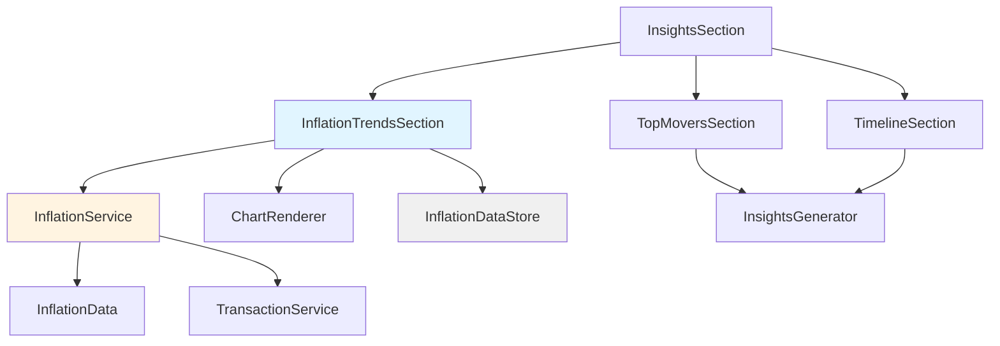
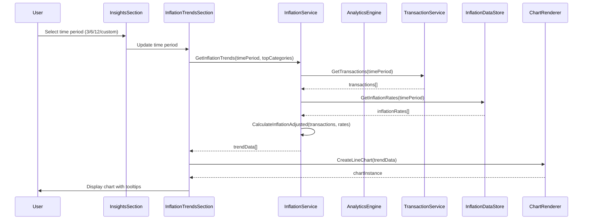

# Design Document: Inflation Trend for Top Movers

## Overview

This feature adds inflation trend analysis to the Insights section of BlinkBudget, showing how inflation affects spending patterns over time for the user's top spending categories. Users can select time periods (3, 6, 12, or custom months) to view inflation-adjusted trends, helping them understand how their spending is impacted by rising prices. The implementation integrates seamlessly with existing Insights sections, sharing navigation controls and chart rendering infrastructure.

## Architecture

### Component Structure



### Data Flow



## Components and Interfaces

### InflationTrendsSection Component

**Purpose**: Main UI component for displaying inflation trend analysis

**Interface**:

```pascal
INTERFACE InflationTrendsSection
  METHOD render(planningData, chartRenderer, activeCharts, sharedMonthState)
    INPUT:
      planningData: Object { transactions: Array }
      chartRenderer: Object { createLineChart, destroyChart }
      activeCharts: Map { String -> Chart }
      sharedMonthState: Object { offset: Number, onNavigate: Function }
    OUTPUT: Object { element: HTMLElement, cleanup: Function }

  METHOD updateTimePeriod(newPeriod)
    INPUT: newPeriod: Number (months count)
    OUTPUT: Void

  METHOD updateCategories(topCategories)
    INPUT: topCategories: Array { category: String, total: Number }
    OUTPUT: Void

  METHOD renderChart()
    INPUT: Void
    OUTPUT: Void
END INTERFACE
```

**Responsibilities**:

- Render the inflation trend UI with time period selector
- Manage chart lifecycle (creation, updates, destruction)
- Handle user interactions (time period selection, tooltips)
- Coordinate with InflationService for data calculations
- Share month navigation state with other Insights sections

### InflationService

**Purpose**: Core business logic for inflation trend calculations

**Interface**:

```pascal
INTERFACE InflationService
  METHOD getInflationTrends(transactions, inflationRates, timePeriod, topCategories)
    INPUT:
      transactions: Array { id, amount, category, timestamp, type }
      inflationRates: Array { month: String, rate: Number }
      timePeriod: Number (months count)
      topCategories: Array { category: String, total: Number }
    OUTPUT: Array {
      category: String,
      months: Array { month: String, nominal: Number, adjusted: Number, diffPercent: Number }
    }

  METHOD calculateInflationAdjusted(nominalAmount, inflationRate)
    INPUT:
      nominalAmount: Number
      inflationRate: Number (monthly rate as decimal)
    OUTPUT: Number (inflation-adjusted amount)

  METHOD getInflationRates(timePeriod)
    INPUT: timePeriod: Number (months count)
    OUTPUT: Array { month: String, rate: Number }

  METHOD getTopCategories(transactions, count)
    INPUT:
      transactions: Array
      count: Number
    OUTPUT: Array { category: String, total: Number }

  METHOD calculateCumulativeInflationFactor(inflationRates)
    INPUT: inflationRates: Array { rate: Number }
    OUTPUT: Array { factor: Number }
END INTERFACE
```

**Responsibilities**:

- Calculate inflation-adjusted spending values
- Identify top spending categories
- Manage inflation rate data
- Cache calculated results for performance

### InflationDataStore

**Purpose**: Data persistence and retrieval for inflation rates

**Interface**:

```pascal
INTERFACE InflationDataStore
  METHOD getInflationRates(monthsBack)
    INPUT: monthsBack: Number
    OUTPUT: Array { month: String, rate: Number }

  METHOD setInflationRates(rates)
    INPUT: rates: Array { month: String, rate: Number }
    OUTPUT: Void

  METHOD getLatestInflationRate()
    OUTPUT: Number (most recent rate)

  METHOD hasInflationData()
    OUTPUT: Boolean
END INTERFACE
```

**Responsibilities**:

- Store and retrieve inflation rate data
- Provide fallback rates when data is unavailable
- Manage inflation data lifecycle

## Data Models

### InflationRate

```pascal
STRUCTURE InflationRate
  month: String (format: "YYYY-MM")
  rate: Number (monthly inflation rate as decimal, e.g., 0.005 for 0.5%)
END STRUCTURE
```

### TrendDataPoint

```pascal
STRUCTURE TrendDataPoint
  month: String (format: "YYYY-MM")
  nominal: Number (actual spending amount)
  adjusted: Number (inflation-adjusted spending)
  diffPercent: Number (percentage difference between nominal and adjusted)
  isHighlighted: Boolean (true if diffPercent > 10%)
END STRUCTURE
```

### CategoryTrend

```pascal
STRUCTURE CategoryTrend
  category: String
  months: Array { TrendDataPoint }
  totalNominal: Number
  totalAdjusted: Number
END STRUCTURE
```

### TimePeriodConfig

```pascal
STRUCTURE TimePeriodConfig
  months: Number (3, 6, 12, or custom)
  label: String (display label for UI)
  isCustom: Boolean
END STRUCTURE
```

## Algorithmic Pseudocode

### Main Inflation Trend Calculation Algorithm

```pascal
ALGORITHM calculateInflationTrends
INPUT:
  transactions: Array of transaction objects
  inflationRates: Array of inflation rate objects
  timePeriod: Number of months to analyze
  topCategories: Array of top spending categories

OUTPUT: Array of category trend objects

BEGIN
  // Step 1: Filter transactions by time period
  cutoffDate ← calculateCutoffDate(timePeriod)
  filteredTransactions ← filterTransactions(transactions, cutoffDate)

  // Step 2: Get inflation rates for the time period
  periodInflationRates ← filterInflationRates(inflationRates, cutoffDate)

  // Step 3: Calculate cumulative inflation factors
  cumulativeFactors ← calculateCumulativeInflationFactor(periodInflationRates)

  // Step 4: Group transactions by category and month
  categoryMonthData ← groupByCategoryAndMonth(filteredTransactions)

  // Step 5: Calculate trends for each top category
  trends ← EMPTY_ARRAY
  FOR EACH category IN topCategories DO
    categoryTrend ← createCategoryTrend(
      category.category,
      categoryMonthData[category.category],
      periodInflationRates,
      cumulativeFactors
    )
    trends.ADD(categoryTrend)
  END FOR

  RETURN trends
END
```

### Inflation-Adjusted Spending Calculation

```pascal
ALGORITHM calculateInflationAdjusted
INPUT:
  nominalAmount: Number (actual spending)
  monthlyInflationRate: Number (decimal format)

OUTPUT: Number (inflation-adjusted amount)

BEGIN
  // Formula: adjusted = nominal / (1 + inflation_rate)
  // This represents the purchasing power equivalent

  IF nominalAmount IS NULL OR nominalAmount = 0 THEN
    RETURN 0
  END IF

  IF monthlyInflationRate IS NULL THEN
    // No inflation data available, return nominal
    RETURN nominalAmount
  END IF

  // Calculate inflation factor
  inflationFactor ← 1 + monthlyInflationRate

  // Adjust for inflation
  adjustedAmount ← nominalAmount / inflationFactor

  RETURN adjustedAmount
END
```

### Cumulative Inflation Factor Calculation

```pascal
ALGORITHM calculateCumulativeInflationFactor
INPUT: inflationRates: Array of monthly inflation rates

OUTPUT: Array of cumulative inflation factors

BEGIN
  factors ← EMPTY_ARRAY
  cumulative ← 1.0

  FOR EACH rate IN inflationRates DO
    // Multiply cumulative factor by (1 + rate)
    cumulative ← cumulative * (1 + rate.rate)
    factors.ADD(cumulative)
  END FOR

  RETURN factors
END
```

### Top Categories Selection Algorithm

```pascal
ALGORITHM selectTopCategories
INPUT:
  transactions: Array of transaction objects
  count: Number of categories to select

OUTPUT: Array of top spending categories

BEGIN
  // Group transactions by category
  categoryTotals ← EMPTY_MAP

  FOR EACH transaction IN transactions DO
    // Skip income and transfer transactions
    IF transaction.type = 'income' OR transaction.type = 'transfer' THEN
      CONTINUE
    END IF

    category ← transaction.category OR 'Uncategorized'
    amount ← transaction.amount OR 0

    // Add to category total
    IF categoryTotals[category] IS NULL THEN
      categoryTotals[category] ← 0
    END IF
    categoryTotals[category] ← categoryTotals[category] + amount
  END FOR

  // Convert to array and sort by total (descending)
  categoryArray ← MAP_TO_ARRAY(categoryTotals)
  categoryArray.SORT(compareByTotalDESC)

  // Return top N categories
  RETURN categoryArray.SLICE(0, count)
END
```

## Key Functions with Formal Specifications

### Function: calculateInflationAdjusted

```pascal
FUNCTION calculateInflationAdjusted(nominalAmount, monthlyInflationRate)
  INPUT:
    nominalAmount: Number
    monthlyInflationRate: Number (optional)
  OUTPUT: Number
```

**Preconditions:**

- `nominalAmount` is a non-negative number
- `monthlyInflationRate` is a number between -1 and 1 (optional)

**Postconditions:**

- Returns a non-negative number representing inflation-adjusted spending
- If `monthlyInflationRate` is null: `result = nominalAmount`
- If `monthlyInflationRate` is provided: `result = nominalAmount / (1 + monthlyInflationRate)`
- If `nominalAmount` is 0: `result = 0`

**Loop Invariants:** N/A (no loops)

### Function: calculateCumulativeInflationFactor

```pascal
FUNCTION calculateCumulativeInflationFactor(inflationRates)
  INPUT: inflationRates: Array { month: String, rate: Number }
  OUTPUT: Array { factor: Number }
```

**Preconditions:**

- `inflationRates` is a non-empty array
- Each rate is a number between -1 and 1
- Array is sorted chronologically (oldest to newest)

**Postconditions:**

- Returns array of same length as input
- First factor is always 1.0
- Each subsequent factor = previous_factor \* (1 + current_rate)
- Factors are monotonically increasing if rates are positive

**Loop Invariants:**

- At iteration i: `cumulative = ∏(1 + rate[j])` for j from 0 to i-1
- All factors are positive numbers

### Function: getInflationTrends

```pascal
FUNCTION getInflationTrends(transactions, inflationRates, timePeriod, topCategories)
  INPUT:
    transactions: Array { id, amount, category, timestamp, type }
    inflationRates: Array { month: String, rate: Number }
    timePeriod: Number (months count)
    topCategories: Array { category: String, total: Number }
  OUTPUT: Array { category: String, months: Array { month, nominal, adjusted, diffPercent } }
```

**Preconditions:**

- `transactions` is a valid array of transaction objects
- `inflationRates` contains at least `timePeriod` months of data
- `topCategories` contains at least one category
- `timePeriod` is a positive integer

**Postconditions:**

- Returns array with one entry per top category
- Each category contains months array with trend data points
- Each data point includes nominal, adjusted, and diffPercent values
- Missing months are filled with zero values

**Loop Invariants:**

- All transactions are processed exactly once
- Inflation factors are calculated consistently across all categories

## Example Usage

```pascal
// Example 1: Basic usage with default time period
SECTION ← InflationTrendsSection()
result ← SECTION.render(
  planningData = {
    transactions: [
      { id: "tx1", amount: 100, category: "Food", timestamp: "2024-01-15", type: "expense" },
      { id: "tx2", amount: 150, category: "Food", timestamp: "2024-02-15", type: "expense" }
    ]
  },
  chartRenderer = chartRendererInstance,
  activeCharts = activeChartsMap,
  sharedMonthState = { offset: 0, onNavigate: navigateCallback }
)

// Example 2: Changing time period
SECTION.updateTimePeriod(6)  // Update to 6 months

// Example 3: Updating categories when Top Movers changes
SECTION.updateCategories([
  { category: "Food", total: 2500 },
  { category: "Transport", total: 1200 },
  { category: "Utilities", total: 800 }
])

// Example 4: Inflation calculation
SERVICE ← InflationService()
trends ← SERVICE.getInflationTrends(
  transactions = transactionArray,
  inflationRates = rateArray,
  timePeriod = 12,
  topCategories = topCategoriesArray
)

// Example 5: Error handling
IF NOT SERVICE.hasInflationData() THEN
  DISPLAY_MESSAGE("Inflation data not available. Showing nominal spending only.")
END IF
```

## Correctness Properties

### Property 1: Inflation Adjustment Accuracy

**Universal Quantification:**
∀ transactions ∈ Transactions, ∀ rates ∈ InflationRates:

- adjusted = nominal / (1 + rate)
- If rate = 0, then adjusted = nominal
- If rate > 0, then adjusted < nominal
- If rate < 0, then adjusted > nominal

### Property 2: Cumulative Factor Monotonicity

**Universal Quantification:**
∀ rates ∈ InflationRates where rate ≥ 0:

- cumulative[i] ≤ cumulative[j] for all i < j
- cumulative[0] = 1.0

### Property 3: Category Trend Completeness

**Universal Quantification:**
∀ category ∈ topCategories, ∀ month ∈ timePeriod:

- trend[category].months[month] exists
- trend[category].months[month].nominal ≥ 0
- trend[category].months[month].adjusted ≥ 0

### Property 4: Chart Update Consistency

**Universal Quantification:**
∀ timePeriod change, ∀ chart ∈ activeCharts:

- chart is destroyed before new chart creation
- new chart uses updated data
- chart ID remains consistent for tracking

## Error Handling

### Error Scenario 1: No Transactions

**Condition**: No transactions exist for the selected time period
**Response**: Display placeholder message "No transaction data available for the selected time period"
**Recovery**: User can select different time period or add transactions

### Error Scenario 2: Missing Inflation Data

**Condition**: Inflation data unavailable for selected period
**Response**: Display message "Inflation data not available. Showing nominal spending only."
**Recovery**: System continues to display nominal spending data

### Error Scenario 3: Chart Rendering Failure

**Condition**: Chart library fails to render
**Response**: Display message "Unable to render inflation trends. Please try again."
**Recovery**: Log error to console, allow user to retry

### Error Scenario 4: Invalid Time Period

**Condition**: User selects invalid time period (negative or zero)
**Response**: Default to 12 months
**Recovery**: Display warning in console, use default value

## Testing Strategy

### Unit Testing Approach

**Test Categories**:

1. Inflation calculation accuracy
2. Top categories selection
3. Cumulative factor computation
4. Chart data transformation

**Key Test Cases**:

- Verify inflation adjustment formula produces correct results
- Test edge cases (zero amount, null rate, negative rate)
- Validate top categories sorting and filtering
- Test chart data structure generation

**Test Coverage Goals**:

- 90%+ code coverage for InflationService
- 80%+ for InflationTrendsSection
- All public methods tested

### Property-Based Testing Approach

**Property Test Library**: fast-check

**Properties to Test**:

1. **Inflation Adjustment**: For any nominal amount and rate, adjusted value follows formula
2. **Cumulative Monotonicity**: Cumulative factors are non-decreasing for positive rates
3. **Category Count**: Output contains exactly topCategories.length entries
4. **Data Completeness**: Each category has exactly timePeriod months of data

**Example Property Test**:

```pascal
PROPERTY inflationAdjustmentFormula
FORALL nominalAmount ∈ [0, 10000], rate ∈ [-0.1, 0.1]
ENSURE adjusted = nominalAmount / (1 + rate)
```

### Integration Testing Approach

**Test Scenarios**:

1. Full Insights section rendering with inflation trends
2. Shared month navigation between sections
3. Time period changes trigger chart updates
4. Category updates from Top Movers section
5. Error states display correctly

## Performance Considerations

### Performance Requirements

- Initial chart render: ≤500ms for 10,000 transactions
- Time period changes: ≤300ms
- Chart updates: ≤300ms

### Optimization Strategies

1. **Caching**:
   - Cache inflation-adjusted calculations
   - Cache top categories selection
   - Cache chart configurations

2. **Debouncing**:
   - Debounce time period changes (200ms)
   - Debounce category updates

3. **Data Filtering**:
   - Filter transactions before processing
   - Only process relevant time period data

4. **Chart Optimization**:
   - Reuse chart instances when possible
   - Use Chart.js dataset updates instead of full re-render

### Memory Management

- Clean up chart instances on component cleanup
- Clear cached calculations on data updates
- Limit inflation data storage to 24 months

## Security Considerations

### Input Validation

- Validate all user-provided time period values
- Sanitize category names before display
- Validate transaction data structure

### XSS Prevention

- Escape all user-provided data before rendering
- Use textContent instead of innerHTML where possible
- Sanitize chart tooltip content

### Data Integrity

- Validate inflation rate data format
- Ensure transaction timestamps are valid dates
- Verify category totals are non-negative

## Dependencies

### External Dependencies

- Chart.js (existing project dependency)
- AnalyticsEngine (existing project module)

### Internal Dependencies

- InsightsGenerator (existing module)
- TransactionService (existing module)
- ChartRenderer (existing utility)
- InsightsSection (existing component)

### Data Dependencies

- Transactions (from TransactionService)
- Inflation rates (from InflationDataStore)
- Category data (from InsightsGenerator.topMovers)

## Integration Points

### With Existing Insights Sections

1. **Shared Month Navigation**:
   - InflationTrendsSection uses sharedMonthState
   - Updates triggered by onNavigate callback
   - Maintains consistent month offset across sections

2. **Chart Rendering**:
   - Uses same chartRenderer instance
   - Shares activeCharts Map for tracking
   - Follows same chart ID conventions

3. **Data Flow**:
   - Receives planningData from parent
   - Uses InsightsGenerator for top categories
   - Integrates with existing analytics pipeline

### With Analytics Engine

- Leverages existing caching infrastructure
- Uses AnalyticsEngine for transaction filtering
- Integrates with existing metrics calculations

### With Chart Configuration

- Uses existing COLORS and CATEGORY_COLORS constants
- Follows same chart rendering patterns
- Shares tooltip configuration
