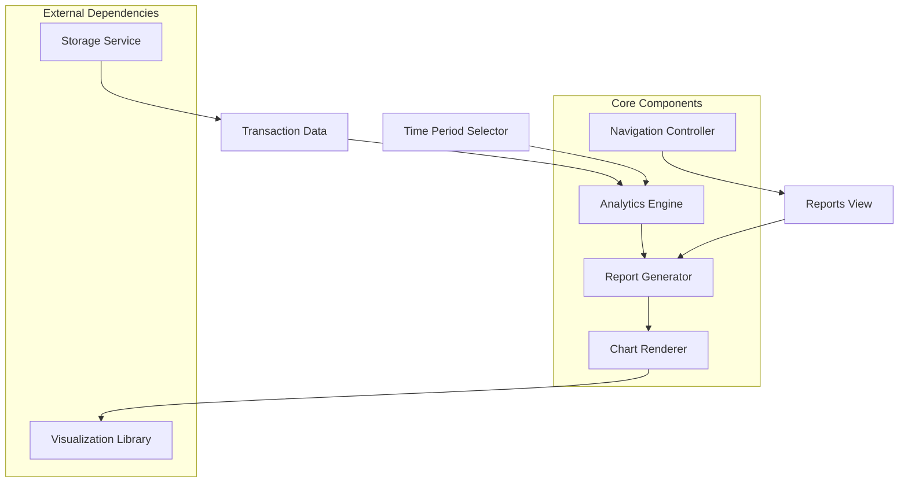
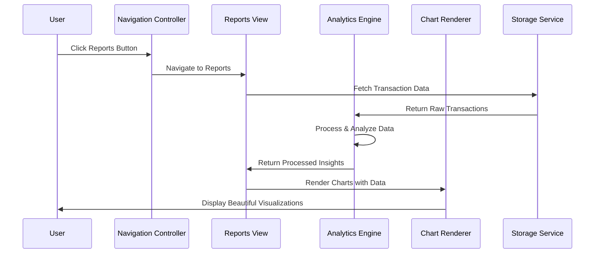

# Design Document: Beautiful Reports & Insights

## Overview

The Beautiful Reports & Insights feature transforms BlinkBudget into a comprehensive financial analytics platform by adding sophisticated data visualization and automated insight generation capabilities. This feature leverages the existing transaction data stored in localStorage to provide users with actionable financial intelligence through beautiful, interactive charts and automated pattern recognition.

The design emphasizes performance, accessibility, and visual appeal while maintaining BlinkBudget's core principle of simplicity. The feature integrates seamlessly with the existing vanilla JavaScript architecture and provides both desktop and mobile-optimized experiences.

## Architecture

### High-Level Architecture



### Component Interaction Flow



## Components and Interfaces

### 1. Analytics Engine (`src/core/analytics-engine.js`)

**Purpose:** Processes raw transaction data to generate insights, calculations, and predictions.

**Key Methods:**
```javascript
class AnalyticsEngine {
  // Core analysis methods
  calculateCategoryBreakdown(transactions, timePeriod)
  calculateIncomeVsExpenses(transactions, timePeriod)
  generateSpendingInsights(transactions, timePeriod)
  calculateCostOfLiving(transactions, timePeriod)
  
  // Predictive analytics
  predictFutureSpending(historicalData, months)
  detectSpendingPatterns(transactions)
  
  // Comparison methods
  comparePeriodsSpending(currentPeriod, previousPeriod)
  identifySpendingTrends(transactions, periods)
}
```

**Data Processing Pipeline:**
1. **Data Validation:** Ensure transaction data integrity
2. **Time Filtering:** Filter transactions by selected time period
3. **Category Aggregation:** Group and sum transactions by category
4. **Trend Analysis:** Compare current vs historical periods
5. **Insight Generation:** Create human-readable observations
6. **Caching:** Store processed results for performance

### 2. Report Generator (`src/components/ReportGenerator.js`)

**Purpose:** Orchestrates data processing and coordinates between analytics and visualization components.

**Key Methods:**
```javascript
class ReportGenerator {
  // Main report generation
  generateSpendingReport(timePeriod)
  generateIncomeReport(timePeriod)
  generateInsightsReport(timePeriod)
  
  // Data formatting for charts
  formatDataForPieChart(categoryData)
  formatDataForBarChart(timeSeriesData)
  formatDataForLineChart(trendData)
  
  // Report caching and performance
  getCachedReport(reportType, timePeriod)
  invalidateCache(reportType)
}
```

### 3. Chart Renderer (`src/components/ChartRenderer.js`)

**Purpose:** Handles all chart creation, updates, and interactions using Chart.js library.

**Key Methods:**
```javascript
class ChartRenderer {
  // Chart creation
  createPieChart(canvasElement, data, options)
  createBarChart(canvasElement, data, options)
  createLineChart(canvasElement, data, options)
  
  // Chart management
  updateChart(chartInstance, newData)
  destroyChart(chartInstance)
  
  // Responsive design
  resizeChart(chartInstance)
  applyMobileOptimizations(chartInstance)
}
```

**Chart Configuration:**
- **Color Palette:** Consistent with BlinkBudget's design system
- **Accessibility:** WCAG 2.1 AA compliant colors and patterns
- **Responsiveness:** Adaptive sizing for mobile and desktop
- **Interactivity:** Hover effects, tooltips, and click handlers

### 4. Navigation Controller (`src/core/navigation-controller.js`)

**Purpose:** Manages view transitions and navigation state between dashboard and reports.

**Key Methods:**
```javascript
class NavigationController {
  // View management
  navigateToReports()
  navigateBackToDashboard()
  
  // State management
  setActiveView(viewName)
  getActiveView()
  
  // Mobile/Desktop adaptation
  updateNavigationForMobile()
  updateNavigationForDesktop()
}
```

### 5. Reports View (`src/views/ReportsView.js`)

**Purpose:** Main view component that renders the reports interface and coordinates user interactions.

**Key Methods:**
```javascript
class ReportsView {
  // View lifecycle
  render()
  mount()
  unmount()
  
  // User interactions
  handleTimePeriodChange(newPeriod)
  handleChartTypeToggle(chartType)
  handleExportRequest()
  
  // Data loading
  loadReportData(timePeriod)
  refreshData()
}
```

## Data Models

### Transaction Data Structure
```javascript
// Existing transaction structure (from current BlinkBudget)
const transaction = {
  id: string,
  amount: number,
  category: string,
  description: string,
  date: Date,
  type: 'income' | 'expense'
}
```

### Analytics Data Models

```javascript
// Category breakdown data
const categoryBreakdown = {
  categories: [
    {
      name: string,
      amount: number,
      percentage: number,
      transactionCount: number,
      color: string
    }
  ],
  totalAmount: number,
  timePeriod: TimePeriod
}

// Income vs Expense summary
const incomeExpenseSummary = {
  totalIncome: number,
  totalExpenses: number,
  netBalance: number,
  timePeriod: TimePeriod,
  previousPeriodComparison: {
    incomeChange: number,
    expenseChange: number,
    balanceChange: number
  }
}

// Generated insights
const spendingInsight = {
  id: string,
  type: 'increase' | 'decrease' | 'pattern' | 'anomaly',
  category: string,
  message: string,
  severity: 'low' | 'medium' | 'high',
  actionable: boolean,
  recommendation?: string
}

// Time period configuration
const timePeriod = {
  type: 'daily' | 'weekly' | 'monthly' | 'custom',
  startDate: Date,
  endDate: Date,
  label: string
}
```

### Chart Data Models

```javascript
// Chart.js compatible data structure
const chartData = {
  labels: string[],
  datasets: [
    {
      label: string,
      data: number[],
      backgroundColor: string[],
      borderColor: string[],
      borderWidth: number
    }
  ]
}

// Chart configuration
const chartOptions = {
  responsive: boolean,
  maintainAspectRatio: boolean,
  plugins: {
    legend: object,
    tooltip: object,
    accessibility: object
  },
  scales: object,
  animation: object
}
```

## Technology Decisions

### Charting Library Selection: Chart.js

**Rationale:**
Based on research, Chart.js is the optimal choice for BlinkBudget because:

1. **Vanilla JavaScript Compatibility:** Works seamlessly without React/Vue dependencies
2. **Bundle Size:** Modular architecture allows importing only needed chart types (~50KB minified)
3. **Performance:** Canvas-based rendering handles up to 1000+ data points efficiently
4. **Accessibility:** Built-in ARIA support and keyboard navigation
5. **Customization:** Extensive theming and styling options
6. **Community:** Large community, excellent documentation, and active maintenance

**Alternative Considerations:**
- **D3.js:** Too complex for BlinkBudget's needs, steep learning curve
- **Recharts:** React-specific, doesn't align with vanilla JS architecture
- **ApexCharts:** Good alternative but larger bundle size and less customizable

### Chart.js Integration Strategy

```javascript
// Modular import for optimal bundle size
import {
  Chart as ChartJS,
  CategoryScale,
  LinearScale,
  PointElement,
  LineElement,
  ArcElement,
  BarElement,
  Title,
  Tooltip,
  Legend,
} from 'chart.js';

// Register only needed components
ChartJS.register(
  CategoryScale,
  LinearScale,
  PointElement,
  LineElement,
  ArcElement,
  BarElement,
  Title,
  Tooltip,
  Legend
);
```

### Performance Optimizations

1. **Data Caching:** Cache processed analytics results in localStorage
2. **Lazy Loading:** Load Chart.js library only when reports view is accessed
3. **Debounced Updates:** Debounce chart updates during time period changes
4. **Memory Management:** Properly destroy chart instances when navigating away
5. **Progressive Enhancement:** Show loading states while processing data

## Correctness Properties

*A property is a characteristic or behavior that should hold true across all valid executions of a system—essentially, a formal statement about what the system should do. Properties serve as the bridge between human-readable specifications and machine-verifiable correctness guarantees.*

After analyzing the acceptance criteria, I've identified several key properties that can be validated through property-based testing. Many properties focus on calculation accuracy, data consistency, and UI behavior that should hold across all possible inputs.

### Property Reflection

Before defining the final properties, I've reviewed all testable criteria to eliminate redundancy:

- **Calculation Properties:** Multiple requirements test similar calculation accuracy (income, expenses, averages) - these can be consolidated into comprehensive calculation properties
- **Chart Rendering Properties:** Several requirements test chart behavior - these can be combined into chart consistency properties  
- **Time Period Properties:** Multiple requirements test time period changes - these can be unified into time period consistency properties
- **Accessibility Properties:** Several requirements test accessibility features - these can be combined into comprehensive accessibility properties

### Core Properties

**Property 1: Time Period Data Consistency**
*For any* valid time period selection, changing the time period should result in all calculations (income, expenses, averages, trends) being recalculated to match exactly the transactions within that period
**Validates: Requirements 1.2, 2.5, 3.3**

**Property 2: Calculation Accuracy**
*For any* set of transactions, the sum of calculated income should equal the sum of all income transactions, the sum of calculated expenses should equal the sum of all expense transactions, and the net balance should equal income minus expenses
**Validates: Requirements 2.1, 2.2, 2.3, 3.1, 3.2**

**Property 3: Chart Data Consistency**
*For any* transaction dataset, providing the same data to different chart types (pie, bar, line) should result in charts that represent the same underlying values, just with different visual presentations
**Validates: Requirements 1.5, 5.2**

**Property 4: Accessibility Compliance**
*For any* generated chart or visual element, all colors should meet WCAG 2.1 AA contrast requirements, all interactive elements should be keyboard navigable, and all visual elements should have appropriate alternative text
**Validates: Requirements 1.3, 8.2, 8.3, 8.4, 8.5**

**Property 5: Hover Interaction Completeness**
*For any* chart with data segments, hovering over each segment should display detailed information including the correct amount and percentage for that segment
**Validates: Requirements 1.4**

**Property 6: Insight Generation Accuracy**
*For any* comparison between current and previous periods, generated percentage-based insights should accurately reflect the mathematical difference between the periods
**Validates: Requirements 4.1, 4.2**

**Property 7: Category Analysis Consistency**
*For any* transaction dataset, the top spending categories identified should be mathematically correct (highest amounts), and category breakdowns should sum to the total expenses
**Validates: Requirements 4.3, 3.4**

**Property 8: Navigation State Persistence**
*For any* user navigation between views, the selected time period and view preferences should be preserved and restored when returning to the reports view
**Validates: Requirements 7.4**

**Property 9: Performance Requirements**
*For any* dataset up to 1000 transactions, insight calculations should complete within 1 second and report loading should complete within 2 seconds
**Validates: Requirements 9.2, 7.5**

**Property 10: Responsive Design Consistency**
*For any* screen size within supported ranges, charts should maintain readability and all interactive elements should remain usable
**Validates: Requirements 8.6**

**Property 11: Data Integrity**
*For any* transaction processing operation, no data duplication should occur and all original transaction data should remain unchanged
**Validates: Requirements 9.1**

**Property 12: Cache Consistency**
*For any* cached calculation, when new transactions are added that affect the cached result, the cache should be invalidated and recalculated to reflect the new data
**Validates: Requirements 9.3, 9.4**

**Property 13: Error Handling Robustness**
*For any* incomplete or malformed transaction data, the system should handle it gracefully without throwing errors and provide appropriate fallback behavior
**Validates: Requirements 9.5**

**Property 14: Prediction Reasonableness**
*For any* historical spending pattern with sufficient data, generated predictions should fall within reasonable bounds based on the historical variance and trends
**Validates: Requirements 6.1, 6.2, 6.3, 6.4, 6.6**

**Property 15: Visual Consistency**
*For any* chart rendering, the visual style should be consistent with BlinkBudget's design language and maintain the same styling patterns across all chart types
**Validates: Requirements 8.1**

## Error Handling

### Data Quality Issues
- **Missing Transactions:** Display appropriate empty states with helpful messaging
- **Corrupted Data:** Graceful degradation with error logging
- **Invalid Dates:** Date validation with user-friendly error messages
- **Malformed Categories:** Default categorization with user notification

### Performance Issues
- **Large Datasets:** Progressive loading and data pagination for >1000 transactions
- **Memory Constraints:** Efficient chart destruction and garbage collection
- **Slow Calculations:** Loading indicators and background processing
- **Network Issues:** Offline capability with cached data

### User Experience Errors
- **Chart Rendering Failures:** Fallback to table view with same data
- **Browser Compatibility:** Polyfills for older browsers
- **Mobile Performance:** Optimized rendering for lower-powered devices
- **Accessibility Failures:** Alternative data presentation methods

### Error Recovery Strategies
```javascript
// Example error handling pattern
class ReportGenerator {
  async generateReport(timePeriod) {
    try {
      const data = await this.analyticsEngine.processData(timePeriod);
      return this.formatReport(data);
    } catch (error) {
      console.error('Report generation failed:', error);
      
      // Attempt fallback with cached data
      const cachedData = this.getCachedReport(timePeriod);
      if (cachedData) {
        this.showWarning('Using cached data due to processing error');
        return cachedData;
      }
      
      // Final fallback to basic summary
      return this.generateBasicSummary(timePeriod);
    }
  }
}
```