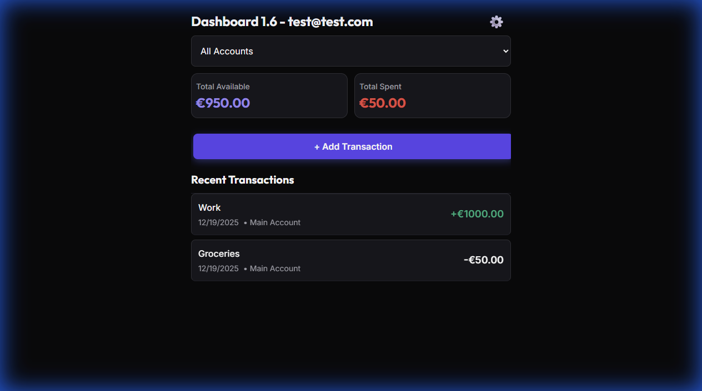
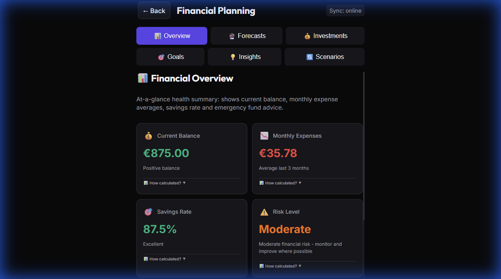

# BlinkBudget - Fast Expense Tracking


**Track your expenses in 3 clicks max.** BlinkBudget transforms expense tracking into a swift, almost unconscious habit with beautiful, actionable insights for smarter financial decisions.

## Screenshots

### Desktop View



### Mobile View


### Financial Planning View



## Key Features

### Lightning Fast Entry

- **3-click expense logging** - Amount -> Category -> Done
- **Auto-submit on category selection** - No save buttons needed
- **Mobile-optimized interface** focused on speed and simplicity
- **Offline-capable** with localStorage and Service Worker persistence

### Transaction Management

- **Multiple transaction types**: Expenses, Income, Transfers, Refunds
- **Smart categorization** with visual category chips:
  - Food & Groceries, Dining & Coffee, Housing & Bills
  - Transportation, Leisure & Shopping, Personal Care
- **Multi-account support** (Checking, Savings, Credit Card, Cash)
- **Account-to-account transfers** with automatic balance updates
- **Filter transactions by category** tap on the name to show
- **Date filtering functionality** tap on the name to show

### Dashboard & Analytics

- **Real-time balance calculations** across all accounts
- **Account filtering** - View transactions by specific account or all accounts
- **Transaction history** with edit/delete capabilities
- **Visual feedback** for recently added transactions
- **Fixed Dashboard layout** with improved spacing and non-clipping action buttons

### Financial Planning & Insights

BlinkBudget includes a sophisticated financial planning engine that helps you look beyond today's expenses:

- **Interactive Scenario Modeling** - Forecast your net worth based on adjustable variables (investment returns, monthly savings, inflation).
- **Investment Portfolio Tracking** - Monitor your total net worth with manual entry support for various investment types.
- **Long-term Goal Planning** - Define specific financial objectives and track your progress over years or decades.
- **Projected Account Balances** - Visualize how your current spending habits will impact your future bank balances.
- **Risk Assessment & Warnings** - Automatically identifies potential financial risks and provides actionable alerts based on your patterns.
- **Comprehensive Analytics** - Deep dive into your finances with "Top Movers" analysis and historical timeline comparisons.
- **Dynamic Charting** - Toggle between daily and monthly views for precise trend analysis.

### User Experience & UI

- **Responsive layout** optimized for mobile devices
- **Touch-friendly interface** with proper touch targets (56px minimum)
- **Mobile navigation** with bottom tab bar
- **Keyboard-aware UI** that adapts to virtual keyboard
- **PWA support** - Installable as a standalone app with offline support
- **Keyboard shortcut (Escape key)** to exit Settings and return to dashboard
- **Helpful tips on each section**

### Backup & Restore

- **Automatic daily backup** stored in Firebase, representing yesterday's state.
- **Single backup** overwritten each day to keep storage simple.
- **Restore from last backup** replaces current data with the backup (warning shown).
- **Offline safe**: backup skips when offline; restore requires internet.
- **User feedback** via custom events showing start, success, and failure.

### Settings & Customization

- **General Settings section** - Unified Refresh App, Install App, and Logout actions
- **Account management** - Add, edit, delete accounts
- **Date format preferences** (US, ISO, EU formats)
- **Data export/import** capabilities
- **Transaction editing** with validation

## Tech Stack

- **Frontend**: Vanilla JavaScript (ES6 Modules) + Vite
- **Styling**: Vanilla CSS with CSS Custom Properties
- **Storage**: Firebase (Sync) + localStorage for offline-capable data persistence
- **Testing**: Vitest with jsdom environment
- **Build**: Vite with PostCSS optimization
- **PWA**: vite-plugin-pwa for service worker and manifest management

## Quick Start

### Prerequisites

- Node.js (v16 or higher)
- npm or yarn

### Installation

```bash
# Clone the repository
git clone <repository-url>
cd blinkbudget

# Install dependencies
npm install

# Start development server
npm run dev
```

### Available Scripts

```bash
npm run dev        # Start development server
npm run build      # Build for production
npm run preview    # Preview production build
npm test           # Run unit tests
```

## Usage

### Adding a Transaction (3 clicks)

1. **Click** "Add Transaction" button
2. **Enter amount** and select account
3. **Click category** - Transaction automatically saves!

### Managing Accounts

- Go to Settings -> Account Management
- Add new accounts (Checking, Savings, Credit Card, Cash)
- Set default account for quick entry

### Transfers Between Accounts

- Select "Transfer" type in transaction form
- Choose source and destination accounts
- Amount is automatically debited/credited

## Architecture

### Component Structure

- **Functional Components** returning native HTMLElements
- **Props-based** configuration with closure-based state
- **Modular design** with single responsibility principle

### File Organization

```
src/
├── components/     # Reusable UI components
├── views/         # Main application screens
├── core/          # Router, storage, mobile utilities, auth
├── utils/         # Helper functions and constants
└── styles/        # CSS files with design tokens
```

### Key Components

- **TransactionForm** - Smart form with auto-submit
- **DashboardView** - Main screen with stats and transaction list
- **FinancialPlanningView** - Advanced financial planning and forecasting
- **GeneralSection** - Centralized settings for app maintenance and installation
- **MobileNavigation** - Bottom tab navigation for mobile

## Design System

### Colors & Theming

- **HSL color space** for consistent theming
- **CSS Custom Properties** for maintainable styles
- **Semantic color tokens** (primary, surface, error, success)

### Responsive Design

- **Mobile-first** approach with 768px breakpoint
- **Touch-friendly** 56px minimum touch targets
- **Adaptive layouts** for different screen sizes

## Testing

Comprehensive test suite covering:

- Component functionality
- Form validation and submission
- Mobile-specific features
- CSS architecture and optimization

```bash
npm test           # Run all tests
npm test -- --watch # Run tests in watch mode
```

## Production Build

Optimized production builds include:

- **CSS purging** to remove unused styles
- **Autoprefixer** for browser compatibility
- **CSS minification** with cssnano
- **Asset optimization** through Vite
- **PWA Service Worker** generation

## Contributing

This project follows strict coding standards:

- Vanilla JavaScript ES6+ modules
- Functional component patterns
- Semantic HTML with accessibility focus
- Performance-optimized implementations

## License

GPLv3 License

---

**BlinkBudget** - Making expense tracking effortless, all in 3 moves.

**Reminder:** This application leverages AI-assisted development. Most logic and UI components were generated through collaborative AI engineering.
