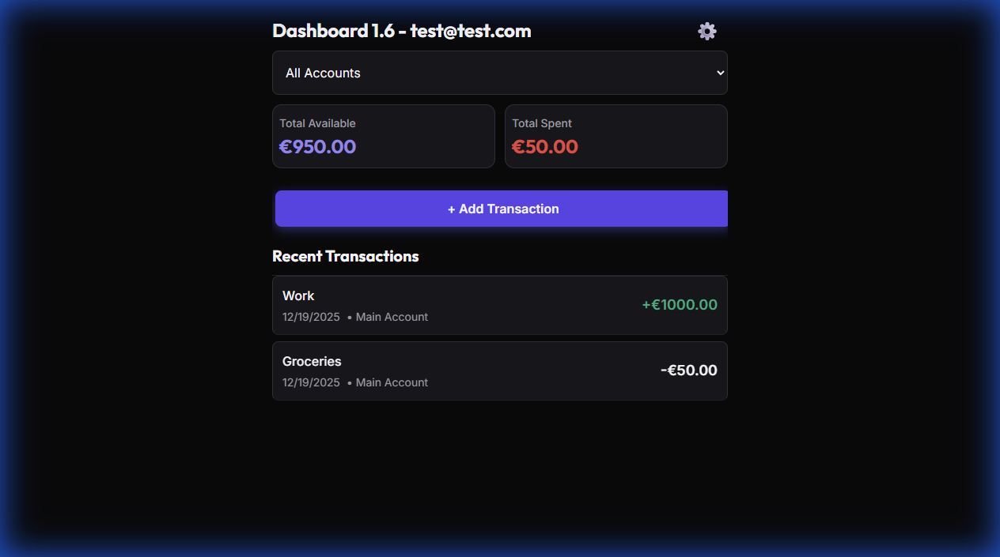
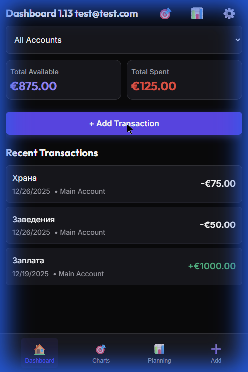
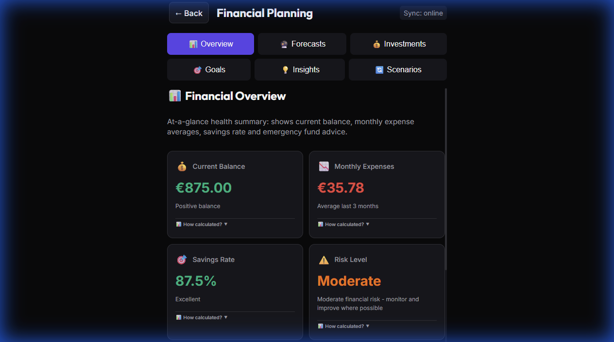

# BlinkBudget - Fast Expense Tracking


**Track your expenses in 3 clicks max.** BlinkBudget transforms expense tracking into a swift, almost unconscious habit with beautiful, actionable insights for smarter financial decisions. | src/core/click-tracking-service.js:recordClick() | src/components/TransactionForm.js:TransactionForm() | src/utils/form-utils/category-chips.js:createCategorySelector()

## Screenshots

### Desktop View



### Mobile View



### Financial Planning View



## Key Features

### Lightning Fast Entry

- **3-click expense logging** - Amount -> Category -> Done | src/core/click-tracking-service.js:startTransactionFlow() | src/core/click-tracking-service.js:recordClick() | src/core/click-tracking-service.js:completeTransactionFlow()
- **Auto-submit on category selection** - No save buttons needed | src/utils/form-utils/category-chips.js:createCategorySelector() - onSubmit callback | src/utils/form-utils/submission.js:handleFormSubmit()
- **Mobile-optimized interface** focused on speed and simplicity | src/core/mobile-utils.js:MobileUtils - mobile detection and optimization | src/components/TransactionForm.js:TransactionForm() - mobile-optimized class
- **Offline-capable** with localStorage and Service Worker persistence | src/pwa.js:registerSW() - Service Worker registration | src/core/transaction-service.js:localStorage operations
- **Ghost Transactions** - See historical transaction data when dates are modified | src/views/EditView.js:ghost transaction rendering | src/core/transaction-service.js:getTransactionsByDate()
- **Dynamic quick amount presets** - Buttons automatically update based on your most frequently used transaction amounts with usage counters and reset functionality | src/components/QuickAmountPresets.js:QuickAmountPresets() | src/core/amount-preset-service.js:recordAmount() | src/core/amount-preset-service.js:getPresets()

### Transaction Management

- **Multiple transaction types**: Support for Expenses, Income, Transfers, and Refunds, with enhanced validation and error reporting | src/utils/form-utils/type-toggle.js:createTypeToggleGroup() | src/utils/form-utils/validation.js:validateAmount() | src/utils/form-utils/validation.js:validateCategory()
- **Optional transaction descriptions**: Add notes to transactions or leave them blank, as you prefer | src/components/TransactionForm.js:noteField creation | src/utils/form-utils/submission.js:prepareTransactionData()
- **Custom Category Management**: Create, edit, and manage your own expense categories for personalized tracking | src/components/CustomCategoryManager.js:CustomCategoryManager() | src/core/custom-category-service.js:CustomCategoryService
- **Category Reordering**: Organize your expense categories in a way that works best for you | src/core/custom-category-service.js:reorderCategories() | src/components/CustomCategoryManager.js:drag and drop handlers
- **Streamlined transaction indicators**: Simplified notifications and indicators for different transaction types:
  - **Refunds** are marked with an ↑ arrow to indicate money coming back | src/components/TransactionListItem.js:sign assignment for refund type
  - **Transfers** are marked with a ⇆ arrow to indicate money moving between accounts | src/components/TransactionListItem.js:sign assignment for transfer type
- **Smart categorization**: Visual category chips for easy identification:
  - Food & Groceries, Dining & Coffee, Housing & Bills
  - Transportation, Leisure & Shopping, Personal Care
  - Plus your custom categories for complete control | src/utils/form-utils/category-chips.js:createCategoryChip() | src/core/custom-category-service.js:getAllCategoryNames()
- **Multi-account support** (Checking, Savings, Credit Card, Cash) | src/core/Account/account-service.js:getAccounts() | src/components/TransactionForm.js:account selection
- **Account-to-account transfers** with automatic balance updates | src/utils/form-utils/category-chips.js:transfer account rendering | src/core/transaction-service.js:updateAccountBalances()
- **Data integrity validation** - Smart checks that recognize all transaction types without false warnings | src/core/data-integrity-service.js:validateTransactionData() | src/utils/form-utils/validation.js:validation functions
- **Filter transactions by category** tap on the name to show | src/components/TransactionListItem.js:onCategoryClick handler | src/views/DashboardView.js:category filtering
- **Date filtering functionality** tap on the name to show | src/components/TransactionListItem.js:onDateClick handler | src/views/DashboardView.js:date filtering
- **Integrated category filtering** between Reports and Dashboard views for consistent analysis across all sections | src/views/ReportsView.js:category filter sync | src/views/DashboardView.js:category filter sync
- **Smart time period navigation** with dynamic labels showing specific months and years | src/views/DashboardView.js:time navigation | src/utils/date-utils.js:date formatting
- **Transaction Split** - Hold transaction to split in two | src/components/TransactionListItem.js:handleSplitTransaction() | src/core/transaction-service.js:split()

### Dashboard & Analytics

- **Real-time balance calculations** across all accounts | src/core/Account/account-service.js:calculateBalances() | src/views/DashboardView.js:balance display
- **Transaction history** with edit/delete capabilities | src/components/TransactionList.js:TransactionList() | src/views/DashboardView.js:transaction rendering
- **Visual feedback** for recently added transactions | src/utils/success-feedback.js:highlightTransactionSuccess() | src/components/TransactionListItem.js:highlight animation
- **Enhanced data visualization** with consistent colors for transactions | src/utils/reports-charts.js:chart rendering | src/utils/constants.js:COLOR definitions
- **Seamless category filtering** between Reports and Dashboard views for consistent analysis | src/views/ReportsView.js:category filter state | src/views/DashboardView.js:category filter state

### Advanced Analytics & Intelligence

BlinkBudget goes beyond basic tracking with sophisticated analytics powered by AI and machine learning:

#### **Spending Intelligence**

- **Category Usage Frequency Analysis** - Track how often you use each category | src/core/analytics/category-usage-service.js:getUsageStatistics() | src/core/analytics-engine.js:generateSpendingInsights()
- **Spending Pattern Recognition** - Identify recurring habits and seasonal trends | src/core/analytics/TrendService.js:analyzeSpendingPatterns() | src/core/analytics-engine.js:pattern recognition
- **Top Movers Analysis** - Discover your biggest spending changes month-over-month | src/core/analytics/ComparisonService.js:getTopMovers() | src/core/analytics/InsightsService.js:topMoversAnalysis
- **Historical Timeline Comparisons** - Compare current spending to previous periods | src/core/analytics/ComparisonService.js:comparePeriods() | src/core/analytics-engine.js:historical comparisons

#### **Budget Optimization**

- **Smart Budget Recommendations** - AI-powered suggestions based on your spending patterns | src/core/analytics/RecommendationService.js:generateBudgetRecommendations() | src/core/analytics-engine.js:budget optimization
- **Category Optimization** - Recommendations to switch categories for better tracking | src/core/analytics/RecommendationService.js:categoryOptimization() | src/core/custom-category-service.js:category suggestions
- **Spending Reduction Suggestions** - Tailored advice to meet savings goals | src/core/analytics/RecommendationService.js:spendingReductionAdvice() | src/core/savings-goals-service.js:goal tracking
- **Budget Health Monitoring** - Real-time status of all budget limits | src/core/budget-service.js:monitorBudgetHealth() | src/core/analytics/InsightsService.js:budget status

#### **Anomaly Detection**

- **Unusual Spending Alerts** - Automatic detection of atypical transactions | src/core/analytics/AnomalyService.js:detectUnusualSpending() | src/core/unusual-spending-detector.js:anomaly detection
- **Large Transaction Warnings** - Notifications for purchases outside your normal range | src/core/analytics/AnomalyService.js:largeTransactionDetection() | src/core/analytics-engine.js:transaction validation
- **Irregular Pattern Identification** - Spot changes in your spending behavior | src/core/analytics/AnomalyService.js:patternAnomalyDetection() | src/core/analytics/TrendService.js:irregular patterns
- **Fraud Prevention** - Early warning system for potential unauthorized charges | src/core/analytics/AnomalyService.js:fraudDetection() | src/core/data-integrity-service.js:security validation

#### **Personal Finance Metrics**

- **Personal Inflation Rate** - Track how inflation affects your specific spending | src/components/InflationTrends.js:InflationTrends() | src/utils/inflation-chart-utils.js:calculatePersonalInflation()
- **Cost of Living Analysis** - Personal cost-of-living calculations | src/core/analytics/MetricsService.js:calculateCostOfLiving() | src/core/analytics-engine.js:cost analysis
- **Savings Rate Tracking** - Monitor your savings performance over time | src/core/savings-goals-service.js:trackSavingsRate() | src/core/analytics/MetricsService.js:savings calculations
- **Financial Health Score** - Overall assessment of your financial well-being | src/core/analytics/MetricsService.js:calculateFinancialHealthScore() | src/views/financial-planning/OverviewSection.js:health score display

### Financial Planning & Insights

BlinkBudget includes a comprehensive financial planning suite with 6 specialized sections to help you take control of your financial future:

#### **Overview Section**

- **Financial Health Summary** - Complete picture of your current financial position | src/views/financial-planning/OverviewSection.js:OverviewSection() | src/core/analytics/MetricsService.js:financial health calculations
- **Net Worth Tracking** - Assets vs liabilities visualization | src/views/financial-planning/OverviewSection.js:netWorth calculation | src/core/analytics/MetricsService.js:net worth tracking
- **Savings Rate Analysis** - Monthly and yearly savings performance | src/core/savings-goals-service.js:analyzeSavingsRate() | src/views/financial-planning/OverviewSection.js:savings display
- **Key Financial Metrics** - Income-to-expense ratio, average daily spending | src/core/analytics/MetricsService.js:calculateKeyMetrics() | src/views/financial-planning/OverviewSection.js:metrics display

#### **Forecasts Section**

- **Income/Expense Predictions** - Forecasting based on historical patterns | src/views/financial-planning/ForecastsSection.js:ForecastsSection() | src/core/analytics/PredictionService.js:generatePredictions()
- **Account Balance Projections** - Future balances for all accounts up to 12 months | src/core/Account/account-balance-predictor.js:predictBalances() | src/views/financial-planning/ForecastsSection.js:balance projections
- **Cash Flow Analysis** - Predicted cash inflows and outflows | src/core/forecast-engine.js:analyzeCashFlow() | src/views/financial-planning/ForecastsSection.js:cash flow display
- **Scenario Planning** - "What-if" analysis for major financial decisions | src/core/forecast-engine.js:scenarioAnalysis() | src/views/financial-planning/ForecastsSection.js:scenario planning

#### **Investments Section**

- **Portfolio Tracking** - Monitor investment performance across all asset classes | src/views/financial-planning/InvestmentsSection.js:InvestmentsSection() | src/core/investment-tracker.js:portfolio management
- **Asset Allocation** - Visual breakdown of investment diversification | src/core/investment-tracker.js:analyzeAssetAllocation() | src/views/financial-planning/InvestmentsSection.js:allocation display
- **Performance Metrics** - Returns, growth rates, and risk assessment | src/core/investment-tracker.js:performance calculations | src/views/financial-planning/InvestmentsSection.js:performance display
- **Investment Goals** - Track progress toward investment targets | src/views/financial-planning/InvestmentsSection.js:goal tracking

#### **Goals Section**

- **Long-term Goal Planning** - Set and track financial objectives (retirement, house, etc.) | src/views/financial-planning/GoalsSection.js:GoalsSection() | src/core/goal-planner.js:planGoals()
- **Savings Targets** - Monthly savings requirements to reach goals | src/core/goal-planner.js:calculateSavingsTargets() | src/views/financial-planning/GoalsSection.js:targets display
- **Progress Visualization** - Charts showing goal completion status | src/views/financial-planning/GoalsSection.js:progress charts | src/utils/financial-planning-charts.js:goal progress
- **Milestone Tracking** - Celebrate achievements along the journey | src/core/goal-planner.js:trackMilestones() | src/views/financial-planning/GoalsSection.js:milestone display

#### **Insights Section**

- **Spending Pattern Analysis** - Identify trends and anomalies in your habits | src/views/financial-planning/InsightsSection.js:InsightsSection() | src/core/analytics/TrendService.js:spending patterns
- **Budget Recommendations** - AI-powered suggestions for optimization | src/core/analytics/RecommendationService.js:budgetRecommendations() | src/views/financial-planning/InsightsSection.js:recommendations display
- **Personal Inflation Trends** - Track how inflation affects your personal finances | src/components/InflationTrends.js:InflationTrends() | src/views/financial-planning/InsightsSection.js:inflation trends
- **Unusual Spending Detection** - Automatic alerts for atypical transactions | src/core/analytics/AnomalyService.js:detectUnusualSpending() | src/views/financial-planning/InsightsSection.js:anomaly alerts

#### **Budgets Section**

- **Category Budget Limits** - Set and monitor spending limits per category | src/core/budget-service.js:setCategoryBudgets() | src/views/financial-planning/BudgetsSection.js:BudgetsSection()
- **Budget Health Tracking** - Real-time status (on track, at risk, exceeded) | src/core/budget-service.js:trackBudgetHealth() | src/views/financial-planning/BudgetsSection.js:health status
- **Overspending Alerts** - Notifications when approaching limits | src/core/budget-service.js:checkOverspending() | src/views/financial-planning/BudgetsSection.js:alerts
- **Budget Performance Reports** - Historical budget adherence analysis | src/core/budget-service.js:generatePerformanceReports() | src/views/financial-planning/BudgetsSection.js:performance reports

### User Experience & UI

- **Keyboard-aware UI** that adapts to virtual keyboard | src/core/mobile-utils.js:MobileUtils - keyboard detection | src/core/mobile-utils.js:handleViewportResize()
- **PWA support** - Installable as a standalone app with offline support and visual update notifications when new versions are available | src/pwa.js:registerSW() - Service Worker | src/pwa.js:showUpdateConfirmation() - update notifications
- **Android TWA support** - Trusted Web Activity for native Android app experience with Play Store deployment | src/pwa.js:TWA support configuration | public/.well-known/assetlinks.json - TWA verification
- **Keyboard shortcut (Escape key)** to exit Settings and return to dashboard | src/core/mobile-utils.js:handleKeyDown() - Escape key handling | src/views/SettingsView.js:keyboard navigation
- **Helpful tips on each section** | src/utils/tooltip-config.js:tooltip configuration
- **Top-tier Security** - Advanced XSS protection, strict URL validation, comprehensive privacy compliance, and regular security patches | src/utils/security-utils.js:safeJsonParse() | src/core/privacy-service.js:privacy controls
- **Improved accessibility** with "Skip to Content" links, ARIA roles, and proper form label associations | src/core/accessibility-service.js:accessibility helpers | src/components/TransactionForm.js:ARIA labels
- **Modern component foundation** - BaseComponent building blocks and an Enhanced Button component for consistent UI behavior | src/components/Button.js:ButtonComponent | src/components/BaseComponent.js:BaseComponent foundation
- **Enhanced color schemes** with improved text contrast for better readability | src/utils/constants.js:COLOR definitions | src/styles/base.css:color scheme variables
- **Improved Reports navigation** with filter preservation and breadcrumb indicators for quick category return | src/views/ReportsView.js:navigation state | src/utils/navigation-helper.js:breadcrumb navigation

### Backup & Restore

- **Automatic daily backup** stored in Firebase, representing yesterday's state. | src/core/backup-service.js:automaticDailyBackup() | src/core/sync-service.js:Firebase sync
- **Single backup** overwritten each day to keep storage simple. | src/core/backup-service.js:overwriteDailyBackup() | Firebase storage strategy
- **Restore from last backup** replaces current data with the backup (warning shown). | src/core/backup-service.js:restoreFromBackup() | src/components/BackupRestoreSection.js:restore confirmation
- **Offline safe**: backup skips when offline; restore requires internet. | src/core/backup-service.js:offlineDetection() | src/components/NetworkStatus.js:connection status
- **User feedback** via custom events showing start, success, and failure. | src/core/backup-service.js:emitBackupEvents() | src/utils/toast-notifications.js:backup feedback

### Data Management & Sync

BlinkBudget provides robust data management with cloud synchronization and local-first storage:

#### **Cloud Synchronization**

- **Firebase Integration** - Real-time sync across all your devices | src/core/sync-service.js:SyncService | src/core/auth-service.js:Firebase auth
- **Automatic Conflict Resolution** - Smart merging when data changes on multiple devices | src/core/sync-service.js:resolveConflicts() | src/core/data-integrity-service.js:conflict resolution
- **Offline-First Architecture** - Works perfectly offline, syncs when connection restored | src/core/sync-service.js:offlineFirstSync() | src/components/NetworkStatus.js:connection monitoring
- **Incremental Sync** - Only syncs changed data to minimize bandwidth usage | src/core/sync-service.js:incrementalSync() | src/core/transaction-service.js:change tracking

#### **Data Export & Import**

- **JSON Export** - Complete data export in human-readable format | src/components/DataManagementSection.js:exportJSON() | src/core/emergency-export-service.js:exportData()
- **CSV Export** - Spreadsheet-compatible export for analysis | src/components/DataManagementSection.js:exportCSV() | src/core/emergency-export-service.js:CSV generation
- **Selective Export** - Export specific date ranges or categories | src/components/DataManagementSection.js:selectiveExport() | src/core/emergency-export-service.js:filtered export
- **Import Validation** - Safe import with data integrity checks | src/components/DataManagementSection.js:importValidation() | src/core/data-integrity-service.js:import validation

#### **Account Management**

- **Account Deletion** - Complete account removal with data cleanup | src/core/Account/account-deletion-service.js:deleteAccount() | src/components/AccountDeletionSection.js:deletion UI
- **Data Portability** - Full control over your financial data | src/components/DataManagementSection.js:dataPortability() | src/core/privacy-service.js:data export
- **Privacy Controls** - Granular control over data sharing | src/components/PrivacyControls.js:PrivacyControls | src/core/privacy-service.js:privacy management
- **GDPR Compliance** - Right to data deletion and export | src/core/privacy-service.js:gdprCompliance() | src/components/PrivacyControls.js:GDPR controls

### Security & Privacy

BlinkBudget employs enterprise-grade security measures to protect your sensitive financial data:

#### **Authentication & Access Control**

- **Firebase Authentication** - Secure sign-in with email/password providers | src/core/auth-service.js:AuthService | Firebase auth configuration
- **Session Management** - Automatic session timeout and renewal | src/core/auth-service.js:sessionManagement() | Firebase session handling
- **Multi-Device Security** - Secure sync across all your devices | src/core/sync-service.js:secureSync() | src/core/auth-service.js:multiDeviceAuth
- **Account Recovery** - Safe password reset and account recovery options | src/core/auth-service.js:passwordReset() | Firebase recovery flows

#### **Data Protection**

- **Firestore Security Rules** - Server-side access controls preventing unauthorized data access | firestore.rules:security rules | Firebase security configuration
- **User Data Isolation** - Complete separation of user data with strict ownership verification | src/core/auth-service.js:userIsolation() | firestore.rules:user data rules
- **Encryption in Transit** - All data transmitted over HTTPS/TLS | Firebase HTTPS enforcement | SSL/TLS configuration
- **Input Sanitization** - Comprehensive XSS protection and input validation | src/utils/security-utils.js:safeJsonParse() | src/utils/form-utils/validation.js:input sanitization

#### **Privacy Features**

- **Local-First Storage** - Primary data stored on your device | src/core/transaction-service.js:localStorage operations | src/core/Account/account-service.js:local storage
- **Minimal Data Collection** - Only essential data stored in the cloud | src/core/privacy-service.js:minimalDataCollection() | Firebase data minimization
- **No Third-Party Analytics** - Your data never shared with external services | src/core/privacy-service.js:noThirdPartyAnalytics() | Privacy policy enforcement
- **Transparent Data Usage** - Clear explanation of all data processing | src/core/privacy-service.js:transparentUsage() | Privacy documentation

#### **Security Best Practices**

- **Regular Security Audits** - Continuous monitoring and vulnerability assessment | Planned (securityAudits() function not yet implemented)
- **Dependency Updates** - Automated security patch management | Implemented (npm update workflow with automated dependency management)
- **Secure Coding Standards** - Input validation, output encoding, and secure defaults | src/utils/security-utils.js:secure coding | Development standards
- **Privacy by Design** - Privacy considerations built into every feature | src/core/privacy-service.js:privacyByDesign() | Feature development guidelines

### Performance & Progressive Web App

BlinkBudget delivers exceptional performance with modern web technologies:

#### **Performance Optimization**

- **Instant Loading** - Background data preloading and intelligent caching | src/views/DashboardView.js:preloadReportsData() | src/core/analytics/AnalyticsCache.js:cache management
- **5-Minute Cache System** - Fresh data with instant app startup | src/core/analytics/AnalyticsCache.js:5MinuteCache() | Cache TTL management
- **Incremental Rendering** - Progressive content loading for smooth UX | src/views/DashboardView.js:incrementalRendering() | src/components/TransactionList.js:progressive loading
- **Background Data Refresh** - Automatic updates without blocking the UI | src/core/sync-service.js:backgroundSync() | src/views/DashboardView.js:background refresh
- **Performance Monitoring** - Built-in performance tracking and optimization | src/core/analytics-engine.js:performance tracking | Performance metrics collection

#### **Progressive Web App Features**

- **Offline-First Architecture** - Full functionality without internet connection | src/pwa.js:offlineFirstSupport() | src/core/sync-service.js:offline operations
- **Service Worker** - Intelligent caching and background sync | src/pwa.js:registerSW() | Service Worker caching strategies
- **App Installation** - Install as standalone app on desktop and mobile | src/pwa.js:PWA installation | manifest.webmanifest:PWA configuration
- **Push Notifications** - Update notifications and important alerts | src/pwa.js:update notifications | Push notification system
- **Background Sync** - Automatic data synchronization when connection restored | src/core/sync-service.js:backgroundSync() | Service Worker sync API

#### **Mobile Optimization**

- **Touch-Friendly Interface** - 56px minimum touch targets | src/utils/constants.js:TOUCH_TARGETS | Mobile touch optimization
- **Responsive Design** - Optimized for all screen sizes | src/styles/main.css:responsive design | CSS media queries
- **Gesture Support** - Swipe, long-press, and touch interactions | src/core/mobile-utils.js:gesture support | Touch event handlers
- **Virtual Keyboard Adaptation** - UI adjusts for keyboard visibility | src/core/mobile-utils.js:keyboard adaptation | Viewport management
- **Android TWA Support** - Native Android app experience via Trusted Web Activity | src/pwa.js:TWA configuration | Android TWA deployment

#### **Caching Strategy**

- **Multi-Level Caching** - Browser, service worker, and application caching | src/core/analytics/AnalyticsCache.js:multiLevelCache() | Cache hierarchy
- **Smart Invalidation** - Cache updates only when data changes | src/core/analytics/AnalyticsCache.js:smartInvalidation() | Cache invalidation logic
- **Compression Optimization** - Minified assets and gzip compression | vite.config.js:compression | Build optimization
- **Asset Optimization** - Image optimization and lazy loading | vite.config.js:asset optimization | Lazy loading strategies
- **Network-Aware Loading** - Adaptive loading based on connection quality | src/components/NetworkStatus.js:network awareness | Adaptive loading strategies

### Settings & Customization

- **General Settings section** - Unified Refresh App, Install App, and Logout actions | src/components/GeneralSection.js:GeneralSection() | src/views/SettingsView.js:settings management
- **Account management** - Add, edit, delete accounts | src/components/AccountSection.js:AccountSection() | src/core/Account/account-service.js:account operations
- **Date format preferences** (US, ISO, EU formats) | src/core/settings-service.js:setDateFormat() | src/utils/date-utils.js:date formatting
- **Data export/import** capabilities | src/components/DataManagementSection.js:DataManagementSection() | src/core/emergency-export-service.js:export/import functions
- **Transaction editing** with validation | src/views/EditView.js:EditView() | src/utils/form-utils/validation.js:edit validation
- **Simplified feedback system** - Direct GitHub issues link for bug reports and suggestions | src/views/SettingsView.js:feedback system | GitHub integration

## Tech Stack

- **Frontend**: Vanilla JavaScript (ES6 Modules) + Vite
- **Styling**: Vanilla CSS with CSS Custom Properties
- **Storage**: Firebase (Sync) + localStorage for offline-capable data persistence
- **Testing**: Vitest with jsdom environment
- **Build**: Vite with PostCSS optimization
- **Performance**: Built-in performance monitoring and optimization utilities
- **PWA**: vite-plugin-pwa for service worker and manifest management
- **Package Manager**: Yarn for improved dependency management
- **Android**: Trusted Web Activity (TWA) with Bubblewrap CLI for Play Store deployment

## Quick Start

For everyday use, visit the live web app at [blinkbudget.netlify.app](https://blinkbudget.netlify.app). From there, you can install it as a PWA or download the TWA Android App.

### Android App (Trusted Web Activity)

Download and install the [BlinkBudget APK](https://github.com/Krasen007/BlinkBudget/releases/download/v1.26/blinkbudget-signed.apk) directly on your Android device. The TWA automatically updates from the website, so you'll always have the latest version.

**Note**: You may need to enable "Install from Unknown Sources" in your Android settings. The app is signed and safe to install.

### Prerequisites from source

- Node.js (v22 or higher)
- yarn (v4 or higher)

### Installation

```bash
# Clone the repository
git clone <repository-url>
cd blinkbudget

# Install dependencies
yarn install

# Start development server
yarn run dev
```

### Available Scripts

```bash
yarn run dev        # Start development server
yarn run build      # Build for production
yarn run preview    # Preview production build
yarn test           # Run unit tests
```

## Usage

### Adding a Transaction (3 clicks)

1. **Click** "Add Transaction" button
2. **Enter amount** and select account
3. **Click category** - Transaction automatically saves!

### Managing Accounts

- Go to Settings -> Account Management
- Add new accounts (Checking, Savings, Credit Card, Cash)
- Set default account for quick entry

### Transfers Between Accounts

- Select "Transfer" type in transaction form
- Choose source and destination accounts
- Amount is automatically debited/credited

## Architecture

### Component Structure

- **Functional Components** returning native HTMLElements
- **Props-based** configuration with closure-based state
- **Modular design** with single responsibility principle

### File Organization

```
src/
├── components/     # Reusable UI components
├── views/         # Main application screens
├── core/          # Router, storage, mobile utilities, auth
├── utils/         # Helper functions and constants
└── styles/        # CSS files with design tokens
```

### Key Components

- **TransactionForm** - Smart form with auto-submit
- **DashboardView** - Main screen with stats and transaction list
- **FinancialPlanningView** - Advanced financial planning and forecasting
- **GeneralSection** - Centralized settings for app maintenance and installation
- **MobileNavigation** - Bottom tab navigation for mobile

## Design System

### Colors & Theming

- **HSL color space** for consistent theming
- **CSS Custom Properties** for maintainable styles
- **Semantic color tokens** (primary, surface, error, success)

### Responsive Design

- **Mobile-first** approach with 768px breakpoint
- **Touch-friendly** 56px minimum touch targets
- **Adaptive layouts** for different screen sizes

## Testing

Comprehensive test suite covering:

- Component functionality
- Form validation and submission
- Mobile-specific features
- CSS architecture and optimization

```bash
yarn test           # Run all tests
yarn test -- --watch # Run tests in watch mode
```

## Production Build

Optimized production builds include:

- **CSS purging** to remove unused styles
- **Autoprefixer** for browser compatibility
- **CSS minification** with cssnano
- **Asset optimization** through Vite
- **PWA Service Worker** generation

## Contributing

This project follows strict coding standards:

- Vanilla JavaScript ES6+ modules
- Functional component patterns
- Semantic HTML with accessibility focus
- Performance-optimized implementations

## License

GPLv3 License

---

**BlinkBudget** - Making expense tracking effortless, all in 3 moves.

**Reminder:** This application leverages AI-assisted development. Most logic and UI components were generated through collaborative AI engineering.
