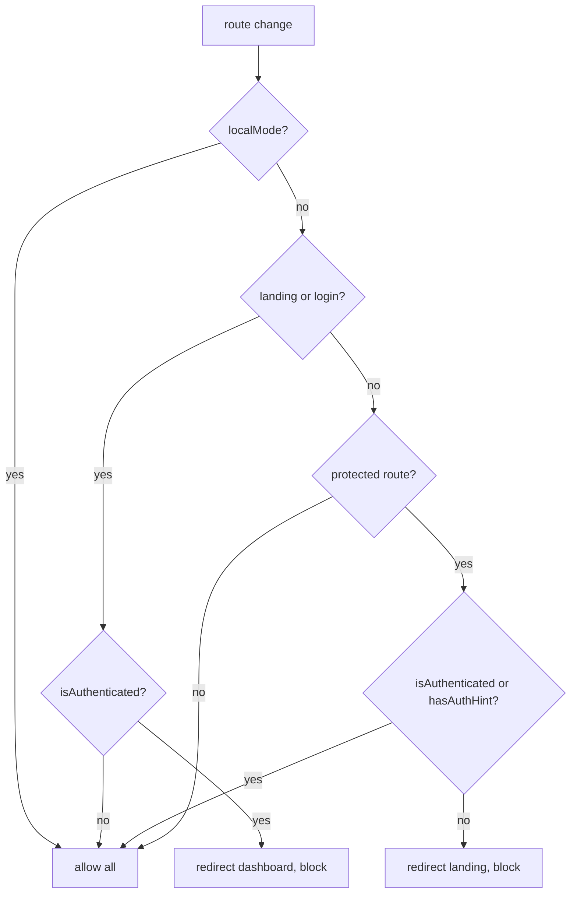
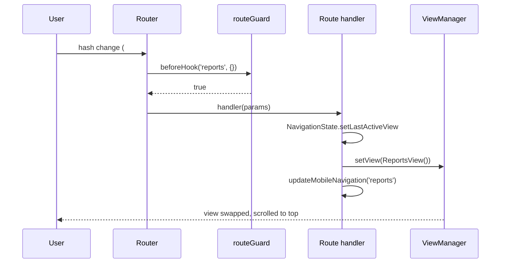

# Routing & Views — Hash Router, Guard, ViewManager

Related: [summary.md](summary.md) · [../data/authentication.md](../data/authentication.md) · [../practices.md](../practices.md)

## Router contract (`src/core/router.js`)

- Static class; URL hash format `#route?param=value` (e.g. `#edit-expense?id=123`).
- Empty hash ⇒ `dashboard`. Unknown route ⇒ warn + redirect `dashboard`.
- API: `on(route, handler)`, `navigate(route, params)`, `before(hook)`, `init()`, `getCurrentRoute()`.
- `before` hook may return `false` (block) or a `Promise<boolean>` (async guard).
- ⚠️ **Ask-first boundary:** changing the core routing system requires user approval.

## Routes (`src/router/routes.js`)

| Route                | View                               | Load strategy |
| -------------------- | ---------------------------------- | ------------- |
| `landing`            | LandingView                        | lazy          |
| `dashboard`          | DashboardView                      | **static**    |
| `add-expense`        | AddView                            | **static**    |
| `edit-expense`       | EditView                           | **static**    |
| `reports`            | ReportsView                        | **static**    |
| `category-manager`   | CustomCategoryManager (component!) | lazy          |
| `settings`           | SettingsView                       | lazy          |
| `financial-planning` | FinancialPlanningView              | lazy          |
| `login`              | LoginView                          | lazy          |

Every handler does the same three steps — keep that order in new routes:

```js
NavigationState.setLastActiveView('settings');
ViewManager.setView(SettingsView());
updateMobileNavigation('settings');
```

Lazy views go through `loadCachedOrImport(cacheKey, importFn)` (ViewPreloader cache).

## Guard (`src/router/guard.js`)



Protected: `dashboard`, `add-expense`, `edit-expense`, `category-manager`, `settings`, `reports`, `financial-planning`. `hasAuthHint()` (the `auth_hint` flag) lets a returning user straight in before Firebase resolves.

## ViewManager (`src/core/view-manager.js`)

```js
setView(view) {
  this.currentView?.cleanup?.();      // views may own teardown
  this.appContainer.innerHTML = '';   // instant swap, no transitions
  this.currentView = view;
  this.appContainer.appendChild(view);
  window.scrollTo(0, 0);              // always reset scroll on view change
}
```

## Navigation sequence



## Invariants

- `ViewManager.setView` is the **only** mount path into `#app`; never `appendChild` a page yourself.
- Views are synchronous DOM returns; async imports happen in the route handler, not inside the view.
- Route names are kebab-case; params are flat strings via `URLSearchParams`.
- Adding a protected route ⇒ update the list in `guard.js` **and** this table.
- `edit-expense` deliberately updates mobile nav to `dashboard` highlight (edit is a child screen of dashboard).
