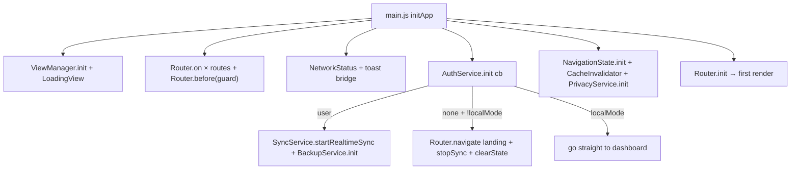

# Architecture — Bootstrap & Module Map

Related: [routing-and-views.md](routing-and-views.md) · [../data/data-model.md](../data/data-model.md) · [../data/authentication.md](../data/authentication.md)

## Bootstrap order (src/main.js) — order matters

1. `InstallService.init()` (try/catch — PWA install prompt)
2. `ViewManager.init(#app)` + append `LoadingView()`
3. Register every route from `src/router/routes.js` → `Router.on(path, handler)`
4. `Router.before(routeGuard)` — auth guard hook
5. Mobile nav: `window.mobileUtils.onResponsiveChange` → re-init `MobileNavigation` when authed/localMode
6. Append `NetworkStatus()` component
7. **Toast bridge:** `window.addEventListener('toast', …)` → dynamic-import `showWarningToast` (design by subtraction: UI never sees Firestore codes)
8. Early mobile nav if `localStorage.auth_hint === 'true'` (no Firebase wait)
9. `AuthService.init(callback)` — the callback is the auth switchboard (below)
10. `NavigationState.init()` → `CacheInvalidator.init()` → mobile back-button handling → `PrivacyService.init()`
11. `Router.init()` — first `handleRoute()`, app renders

## `AuthService.init` callback contract

- **user authenticated** → `localStorage.auth_hint = 'true'`, `SyncService.startRealtimeSync(uid)`, dynamic-import `BackupService.init()`
- **no user + localMode** → navigate to `dashboard`, skip sync
- **no user** → remove mobile nav, clear `auth_hint`, `SyncService.stopSync()`, `NavigationState.clearState()`, redirect `landing` (unless already on `login`/`landing`)
- **any case** → if authed and on `login`/`landing` → `dashboard`; re-init mobile nav; dispatch `auth-state-changed {user}`

## Module map (src/)

| Directory                      | Role                | Notable                                                                                                                                                              |
| ------------------------------ | ------------------- | -------------------------------------------------------------------------------------------------------------------------------------------------------------------- |
| `src/core/`                    | services + engines  | `router.js`, `sync-service.js`, `auth-service.js`, `storage.js` (bridge), `lazy-loader.js`, `data-integrity-service.js`, `forecast-engine.js`, `analytics-engine.js` |
| `src/core/Account/`            | account domain      | `account-service.js`, `account-deletion-service.js`, `account-balance-predictor.js`                                                                                  |
| `src/core/analytics/`          | analytics domain    | `AnalyticsCache`, `TrendService`, `PredictionService`, `AnomalyService`, `FilteringService`, `MetricsService`, `ComparisonService`, `category-usage-service`         |
| `src/core/financial-planning/` | planning data layer | `PlanningDataManager.js`                                                                                                                                             |
| `src/router/`                  | route defs + guard  | `routes.js`, `guard.js`                                                                                                                                              |
| `src/views/`                   | page components     | 8 views + `financial-planning/` sections                                                                                                                             |
| `src/components/`              | reusable UI         | 45+ components + `financial-planning/`                                                                                                                               |
| `src/utils/`                   | helpers             | `constants.js` (single source of keys/colors/timing), `form-utils/`, chart utils, touch utils                                                                        |
| `src/styles/`                  | PostCSS CSS         | see [../ui/styling.md](../ui/styling.md)                                                                                                                             |
| `config/app.config.js`         | env validation      | validates 7 `VITE_FIREBASE_*` vars, derives `localMode`                                                                                                              |

## Invariants

- `main.js` must stay the **only** bootstrap; `pwa.js` is imported for its side effect (SW registration).
- Services never import views; views/components import services.
- Every global event name is in [../terminology.md](../terminology.md) — reuse, don't invent new channels casually.
- Firebase is optional at runtime: **all** cloud calls must degrade gracefully (see `firebaseStatus` guards in [../data/authentication.md](../data/authentication.md)).
