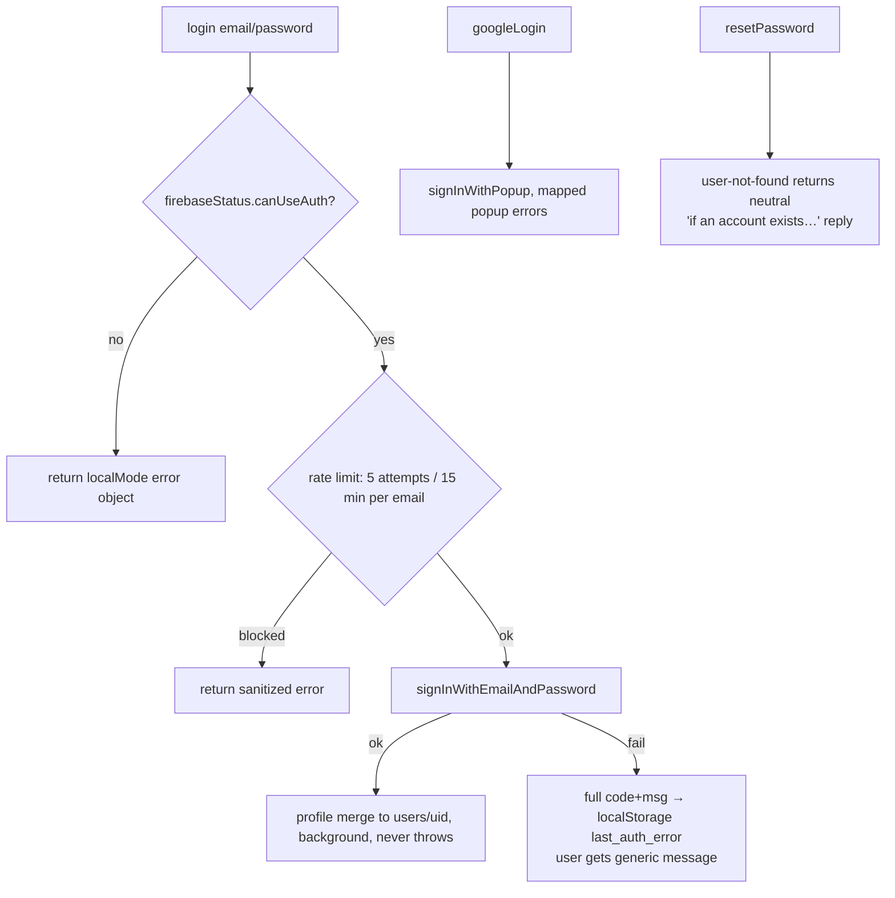

# Authentication — Firebase Auth & Local Mode

Related: [../architecture/summary.md](../architecture/summary.md) · [../architecture/routing-and-views.md](../architecture/routing-and-views.md) · [sync.md](sync.md)

## Two runtime modes (`config/app.config.js` + `firebase-config.js`)

| Mode | Trigger | Behavior |
| --- | --- | --- |
| **localMode** | zero `VITE_FIREBASE_*` env vars (and not `test`) | Firebase never initialized; auth + sync off; guard allows everything; dashboard direct |
| **cloud** | all 7 vars present & valid | Auth + Firestore available; guard protects routes |
| **test** | `MODE === 'test'` | mock firebase config, `validationPassed = true`, never forced into localMode |

Validation: 7 required `VITE_FIREBASE_*` vars, `apiKey.length ≥ 20`, projectId matches `^[a-zA-Z0-9-]+$`. Invalid config in dev renders a full-screen config-error card. ⚠️ Changing Firebase configuration is an **ask-first** boundary.

Firestore is lazy: `getDb()` initializes on first call (after login) with `persistentLocalCache` + multi-tab manager. `firebaseStatus = { isInitialized, hasError, canUseAuth, canUseFirestore() }` is the availability gate every service checks first.

## AuthService (`src/core/auth-service.js`)

- Methods: `login`, `googleLogin`, `resetPassword`, `logout`, `isAuthenticated`, `hasAuthHint`, `getUserId`, `getUserEmail`.
- `user` is frozen: `this.user = user ? Object.freeze({ ...user }) : null`.
- In-memory rate limiter: 5 attempts / 15 min window per email, resets on success window.
- `logout()` clears `auth_hint`; `auth_hint` is the localStorage "recently authed" flag used for early mobile nav + guard grace.
- `init(onAuthStateChange)` resolves once via `onAuthStateChanged`; localMode immediately invokes callback with `null`.

## Error-handling contract (design by subtraction)

1. Full Firebase error `{code, message, timestamp}` → `last_auth_error` (or `last_sync_error`) in localStorage for debugging.
2. `console.warn` the technical details.
3. Return/emit a **sanitized, actionable** user message (e.g. popup-blocked → "please allow popups"; everything unexpected → generic retry text).

The generic `toast` event bridge in `main.js` renders these. **Never** surface raw Firebase codes in the UI.

## Invariants

- Every auth method must degrade gracefully when `firebaseStatus` says unavailable (returns `{error, localMode}` shape, no throw).
- UI decides nothing from Firebase codes — mapping lives here.
- After logout: stop sync, clear `auth_hint` + `NavigationState`, remove mobile nav, land on `landing` (handled in `main.js` callback).
