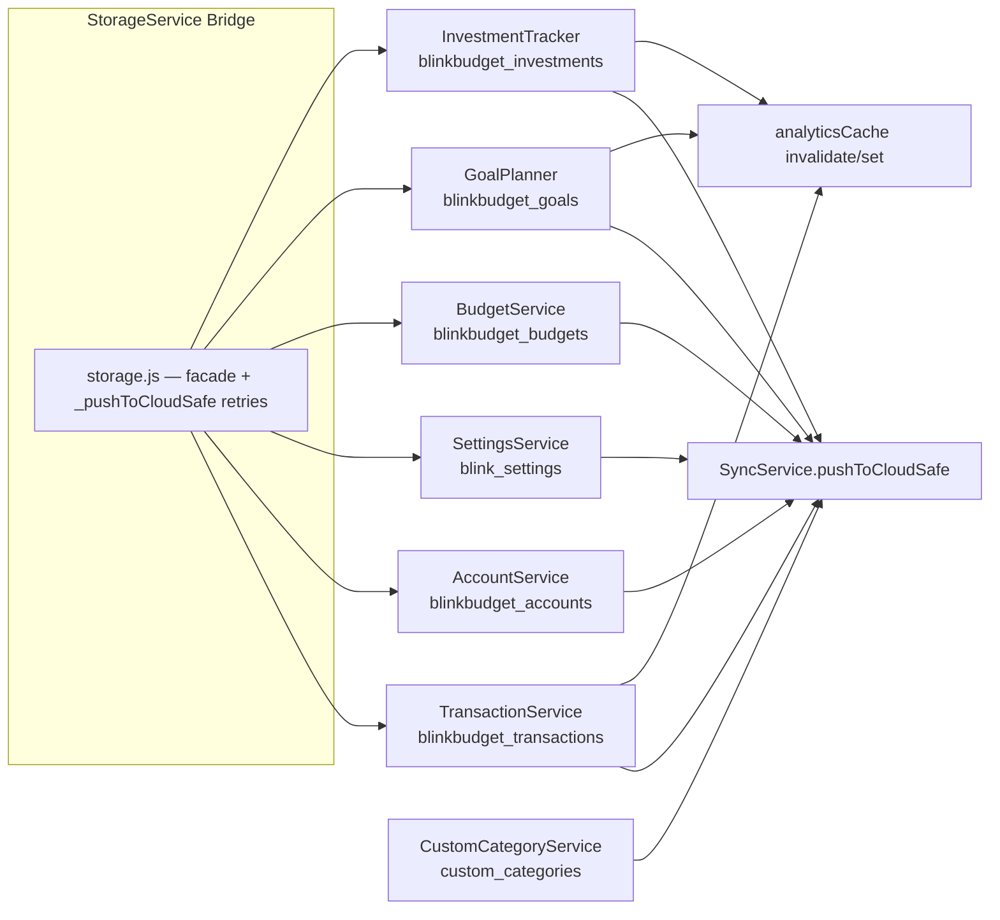

# Data Model — localStorage & Domain Services

Related: [sync.md](sync.md) · [../practices.md](../practices.md) · [../terminology.md](../terminology.md)

## Storage keys (`src/utils/constants.js` → `STORAGE_KEYS`)

| Key                                                                                                                        | Contents               |
| -------------------------------------------------------------------------------------------------------------------------- | ---------------------- |
| `blinkbudget_transactions`                                                                                                 | transactions array     |
| `blinkbudget_accounts`                                                                                                     | accounts array         |
| `custom_categories`                                                                                                        | custom/flag categories |
| `blink_settings`                                                                                                           | settings object        |
| `blinkbudget_investments`                                                                                                  | investments            |
| `blinkbudget_goals`                                                                                                        | savings goals          |
| `blinkbudget_budgets`                                                                                                      | category budgets       |
| `dashboard_filter`, `dashboard_date_filter`, `dashboard_category_filter`, `dashboard_tag_filter`, `dashboard_month_filter` | dashboard UI state     |
| `blinkbudget_click_tracking`                                                                                               | 3-click telemetry      |

Other keys: `auth_hint`, `last_sync_error`, `last_auth_error`, `blinkbudget-version`.

## Transaction shape (as implemented)

```js
{
  id: generateId(),            // uuid-style, from utils/id-utils.js
  amount: 15.5,
  category: 'Храна',           // Bulgarian default or custom category name
  type: 'expense',             // TRANSACTION_TYPES: 'expense' | 'income' | 'transfer' | 'refund'
  accountId: 'main',           // backfilled to default account on read if missing
  toAccountId: null,           // transfers only
  timestamp: '2026-02-21T10:00:00.000Z',
  createdAt / updatedAt: ISO,  // set by TransactionService.add
  userId: AuthService.getUserId(),
  note: 'Lunch',
  tags: ['Work'],              // optional; at most one flag-category name
  // ghost recurrence fields: isGhost, ghostId, movedToDate, originalDate (stripped on copy)
}
```

Custom category: `{ id, name, type: 'expense', color, showAsCheckbox }` — `showAsCheckbox: true` = flag category rendered as checkbox, stored as a transaction **tag**. Renaming/deleting a flag cascades via `TransactionService.renameTagOnAllTransactions / removeTagFromAllTransactions`.

Settings: `{ lastBackupDate, lastBackupDataAsOf, showQuickPresets }` defaults merged over stored object (`SettingsService.getAllSettings`), plus `dateFormat`/`theme` per AGENTS.md.

## Domain services → key ownership



## TransactionService contracts (`src/core/transaction-service.js`)

- `getAll()` **migrates on read**: transactions missing `accountId` get the default account's id, then persist+sync.
- `add()` stamps `id/timestamp/createdAt/updatedAt/userId`, sanitizes via `PrivacyService.sanitizeDataForStorage(t, 'transaction')`, `unshift`s (newest first), and records expense amounts into the analytics engine for quick presets.
- `remove(id)` returns `[{ transaction, index }]` — the exact removed object(s) with their original array positions — or `null`. Cascades a linked ghost (`ghostId`) and removes both in **one** persist. No DOM work on this path → the delete stays instant; the undo UI lives in `utils/transaction-undo.js`.
- `restore(removedEntries)` re-inserts those exact objects at their original positions (highest index first, duplicate-id guard), then persists + syncs + dispatches `storage-updated`. Returns `false` when nothing was restorable.
- `copy(id)` strips id/audit/ghost fields, fresh timestamp. `split(id)` replaces one tx with two. `clear()` wipes + syncs.
- `_persist(arr, sync=true)`: `localStorage.setItem` → optional `SyncService.pushToCloudSafe` → **always** dispatch `storage-updated {key}`.

## Invariants

- UI never touches `localStorage` directly for app data — always via a service.
- Every write ends with `storage-updated`; if you add a key, dispatch it or nothing re-renders.
- Parse everything from storage with `safeJsonParse`.
- `DEFAULTS.ACCOUNT_ID = 'main'` — the default account; `AccountService.getDefaultAccount()` is the fallback everywhere.
- Data-integrity rules live in `src/core/data-integrity-service.js` (e.g. category protection — see `tests/core/data-integrity-categories.test.js`).
