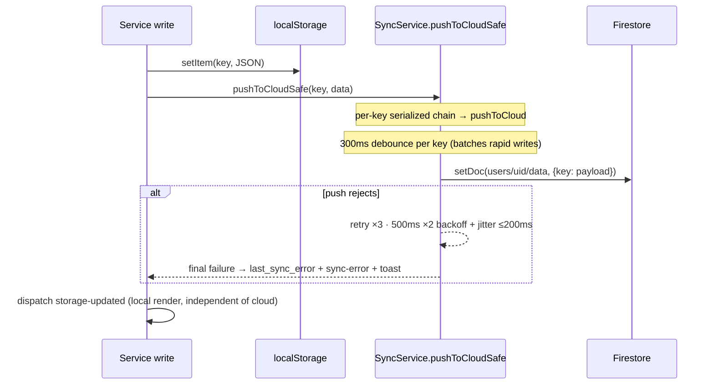

# Sync — Local-First + Firestore

Related: [data-model.md](data-model.md) · [authentication.md](authentication.md) · [../architecture/summary.md](../architecture/summary.md)

## Model

`localStorage` is the source of truth. Firestore (per-user docs) is backup + multi-device. Sync is entirely skipped in `localMode`. Firestore uses `persistentLocalCache` + `persistentMultipleTabManager`, lazily initialized on first `getDb()` call (`src/core/firebase-config.js`).

## Write path (UI → cloud)

- **`SyncService.pushToCloudSafe(dataType, data, retries = 3)`** — the single retry funnel for **every** synced write; _never throws_; serializes pushes per key via `_pushChains`; on final failure writes `last_sync_error` and emits `sync-error` + `toast`.
- **All write paths funnel through it:** `TransactionService._persist`, `SettingsService.saveSetting`, `AccountService._persist`, `CustomCategoryService._persist`, and the StorageService bridge for investments/goals/budgets (via its retained `_pushToCloudSafe` alias).
- **`pushToCloud` never rejects today:** `_executePush` catches all errors itself — logs, writes `last_sync_error`, emits `sync-state` (`state: 'error'`, `isNetworkError` flag) + `toast`, then clears the pending-writes lock and `${key}_lastLocalUpdate` marker. The retry loop in `pushToCloudSafe` only activates if `pushToCloud` ever starts rejecting.
- **`_executePush` network throttle:** ≥500 ms between actual Firestore writes for transactions, ≥2000 ms for other keys; too-frequent pushes are re-scheduled through `pushToCloud`.
- **Known gap:** `sync-state` and `sync-error` currently have **no listeners** — dispatch-only telemetry.

## Read/realtime path

- `startRealtimeSync(uid)` subscribes per data type; incoming snapshots merge into localStorage (deduped by `uniqueById`; accounts also deduped by `name|type` combo), then dispatch `storage-updated`.
- Conflicts: `mergeArraysById` detects near-simultaneous edits (timestamps ≤2 s apart, differing payloads) → dispatches `sync-conflict` and prefers cloud until resolved; `ConflictDialog` → user picks **local** or **cloud** → `sync-conflict-resolution` event → `handleConflictResolution` applies and re-dispatches `storage-updated`.

## Lifecycle & connectivity

- `visibilitychange`: hidden → `stopSync()`; visible → restart if subscribed (saves battery/reads).
- `online`/`offline` events: `isOnline` flag, `connection-change` event; reconnect runs `triggerBackgroundSync()` pushing all 7 syncable keys: transactions, accounts, custom_categories, settings, goals, investments, budgets.
- `sanitize()` helper (sync-service) strips Dates→ISO and breaks circular refs before any Firestore write.

## PWA/network layers (vite.config.js workbox)

- `navigateFallback: offline.html`; pre-caches `**/*.{js,css,html,ico,png,svg}`.
- Firebase API: **NetworkFirst** (3 s timeout) · Chart.js CDN: **CacheFirst** · Google Fonts: StaleWhileRevalidate / CacheFirst.

## Invariants

- Cloud failure must never block or lose a local save — worst case is a toast.
- Domain services call `SyncService.pushToCloudSafe`, never `pushToCloud` (that one is SyncService-internal).
- Never `await` a cloud push in a UI click path; 3-click speed beats sync.
- All syncable data must be JSON-safe (no Dates/cycles) — `sanitize()` is the last line of defense.
- Dashboard filter keys are intentionally **not** synced (device-local UI state).
