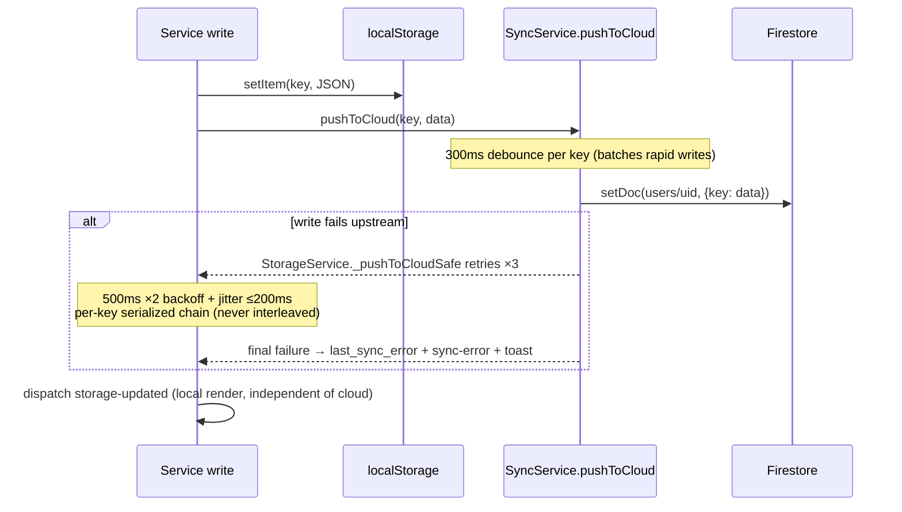

# Sync — Local-First + Firestore

Related: [data-model.md](data-model.md) · [authentication.md](authentication.md) · [../architecture/summary.md](../architecture/summary.md)

## Model

`localStorage` is the source of truth. Firestore (per-user docs) is backup + multi-device. Sync is entirely skipped in `localMode`. Firestore uses `persistentLocalCache` + `persistentMultipleTabManager`, lazily initialized on first `getDb()` call (`src/core/firebase-config.js`).

## Write path (UI → cloud)

- **`_pushToCloudSafe`** (in `storage.js`): the only retry wrapper; *never throws*; chains pushes per key via `_pushChains` Map so concurrent writes to one key serialize.
- `SettingsService` and `TransactionService._persist` call `SyncService.pushToCloud` directly (no retry wrapper) — retries are a bridge-level nicety, not a guarantee.

## Read/realtime path

- `startRealtimeSync(uid)` subscribes per data type; incoming snapshots merge into localStorage (deduped by `uniqueById`; accounts also deduped by `name|type` combo), then dispatch `storage-updated`.
- Conflicts surface as `ConflictDialog` → user picks **local** or **cloud** → `sync-conflict-resolution` event → `handleConflictResolution` applies and re-dispatches `storage-updated`.

## Lifecycle & connectivity

- `visibilitychange`: hidden → `stopSync()`; visible → restart if subscribed (saves battery/reads).
- `online`/`offline` events: `isOnline` flag, `connection-change` event; reconnect runs `triggerBackgroundSync()` pushing all 7 syncable keys: transactions, accounts, custom_categories, settings, goals, investments, budgets.
- `sanitize()` helper (sync-service) strips Dates→ISO and breaks circular refs before any Firestore write.

## PWA/network layers (vite.config.js workbox)

- `navigateFallback: offline.html`; pre-caches `**/*.{js,css,html,ico,png,svg}`.
- Firebase API: **NetworkFirst** (3 s timeout) · Chart.js CDN: **CacheFirst** · Google Fonts: StaleWhileRevalidate / CacheFirst.

## Invariants

- Cloud failure must never block or lose a local save — worst case is a toast.
- Never `await` a cloud push in a UI click path; 3-click speed beats sync.
- All syncable data must be JSON-safe (no Dates/cycles) — `sanitize()` is the last line of defense.
- Dashboard filter keys are intentionally **not** synced (device-local UI state).
