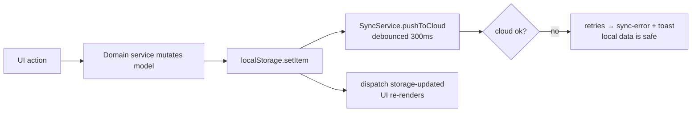

# Practices — Patterns & Conventions in This Codebase

How code is actually written here. Related: [ui/summary.md](ui/summary.md), [data/data-model.md](data/data-model.md), [architecture/summary.md](architecture/summary.md).

## 1. Functional components return DOM elements

No classes, no render methods, no frameworks.

```js
// ✅ src/components/Button.js pattern
export const MyComponent = ({ label, onClick }) => {
  const el = document.createElement('button');
  el.className = 'btn btn-primary'; // CSS classes, never inline static styles
  el.textContent = label; // textContent = XSS-safe
  el.onclick = onClick;
  return el;
};
```

**Invariant:** anything mounted into `#app` goes through `ViewManager.setView()`. Views may expose `cleanup()` — ViewManager calls it before swapping.

## 2. Services are object literals; Router is the one class

```js
export const SettingsService = {
  // object literal, one STORAGE_KEY slice
  saveSetting(key, value) {
    /* read → merge → localStorage → SyncService.pushToCloud → dispatch 'storage-updated' */
  },
};
```

`Router` (`src/core/router.js`) is a `static` class — the only one. Keep it that way (see [architecture/routing-and-views.md](architecture/routing-and-views.md)).

## 3. Local-first write pattern (the core loop)

Every write follows the same sequence; never reorder it:



```js
// SyncService.pushToCloudSafe — the retry contract; single funnel for ALL synced writes
// (Transaction/Settings/Account/CustomCategory services + StorageService bridge alias)
// 3 retries · 500ms backoff ×2 + ≤200ms jitter · per-key serialized chains (_pushChains Map)
// NEVER throws; on final failure writes last_sync_error and emits sync-error + toast.
// pushToCloud() never rejects today (errors handled inside _executePush) — retries are a safety net.
```

**Invariant:** a failed sync must never fail the user's local save. Offline/failed push = toast + `last_sync_error`, nothing else.

## 4. State via DOM events, not stores

Subscribers listen for `storage-updated` / `categories-updated` / `auth-state-changed` / `connection-change` (full glossary: [../terminology.md](../terminology.md)). No pub/sub library, no observers.

## 5. Security practices

- `element.textContent` for all user input; `innerHTML` only for static trusted markup.
- All JSON from `localStorage` goes through `safeJsonParse()` (`src/utils/security-utils.js`) — never raw `JSON.parse`.
- Transactions pass through `PrivacyService.sanitizeDataForStorage(t, 'transaction')` on add (data minimization).
- Auth errors: full details → `last_auth_error` in localStorage; user sees a sanitized message (see [../data/authentication.md](../data/authentication.md)).

## 6. Lazy loading views

Heavy routes import lazily through the preloader cache (`src/router/routes.js`):

```js
const { SettingsView } = await loadCachedOrImport(
  'SettingsView',
  () => import('../views/SettingsView.js')
);
```

Static (instant-nav) routes: `dashboard`, `add-expense`, `edit-expense`, `reports`. Chart.js loads via `src/core/chart-loader.js`; vendor code is split into `firebase` / `charts` / `vendor` chunks in `vite.config.js`.

## 7. Testing & tooling

- Vitest + jsdom, `tests/setup.js`, `testTimeout: 10000`. Config in `vite.config.js` (`test` block).
- Layout mirrors source: `tests/components/`, `tests/core/`, `tests/form-utils/`, `tests/views/`, `tests/property/`, `tests/security/`…
- Run **targeted** tests, not the suite: `yarn vitest run tests/form-utils/validation.test.js`.
- Before commits: `yarn run check` (eslint + stylelint + prettier + validate-docs). Auto-fix: `yarn run fix`.
- Files stay under **500 lines**; lode files under 250.
- Windows shell only: `Get-Content`, `-replace`, `ForEach-Object` — never `cat`/`sed`.

## Known deviations (do not copy, tolerate when touching)

- `src/pwa.js` update dialogs use inline `style.cssText` + `innerHTML` with static strings — legacy; new code must use classes + `textContent`.
- `CURRENCY_SYMBOL` is a hardcoded `'€'` in `src/utils/constants.js` (open item, see [../plans/roadmap.md](../plans/roadmap.md)).
