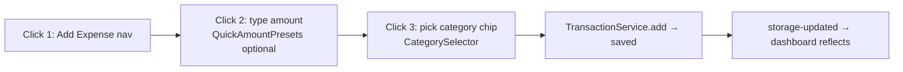

# UI — Components & Views

Related: [styling.md](styling.md) · [../practices.md](../practices.md) · [../architecture/routing-and-views.md](../architecture/routing-and-views.md)

## Conventions

- Functional components returning DOM elements (pattern + example in [../practices.md](../practices.md)).
- Components never fetch directly at module scope; they read services and re-render on `storage-updated` / `categories-updated` / `auth-state-changed` events.
- User input → `textContent`; dialogs (`ConfirmDialog`, `ConflictDialog`, `MobileModal`, `BulkEditDialog`) own focus traps and `aria-modal`.
- Max **500 lines** per file. Larger concerns get subfolders: `components/financial-planning/`, `views/financial-planning/`.

## Views (`src/views/`) — one per route

| View                    | Route                | Size signal                                                                                                |
| ----------------------- | -------------------- | ---------------------------------------------------------------------------------------------------------- |
| DashboardView           | `dashboard`          | biggest view (~45 KB) — stats, filters, transaction list                                                   |
| AddView                 | `add-expense`        | small — the 3-click form (see below)                                                                       |
| EditView                | `edit-expense`       | edit form, reads `?id=`                                                                                    |
| ReportsView             | `reports`            | largest file (~51 KB) — Chart.js heavy                                                                     |
| FinancialPlanningView   | `financial-planning` | tabs: Budgets, Forecasts, Goals, Insights, Investments, Overview (sections in `views/financial-planning/`) |
| SettingsView            | `settings`           | sections: General, DateFormat, Account, DataManagement, BackupRestore, Security, AccountDeletion, Feedback |
| LoginView / LandingView | `login` / `landing`  | unauthenticated entry                                                                                      |

## The 3-click form path

Supporting pieces: `utils/form-utils/` (amount-input, category-chips, type-toggle, keyboard, submission, validation, transaction-tags), `QuickAmountPresets`, `DateInput`, `MobileModal`.

## TransactionForm — tag selector behaviour

`TransactionForm` (`src/components/TransactionForm.js`) creates a `tagSelector` (`createTransactionTagSelector`) unconditionally for **both add and edit modes**. Tags are only meaningful for `expense` / `refund` types — `tagSelector.setTransactionType(type)` hides the selector automatically for `income` and `transfer`.

- **Add mode** (`initialValues.id` absent): selector starts with no pre-selected tag; `applyExpenseTagToTransactionData(payload, tag, false)` writes `tags: [name]` when a tag is chosen, omits `tags` when none is selected.
- **Edit mode** (`initialValues.id` present): selector pre-selects the existing tag via `getTransactionTagName(initialValues)`; `applyExpenseTagToTransactionData(payload, tag, true)` writes `tags: []` to explicitly clear a removed tag.
- The type-toggle wrapper always calls `tagSelector.setTransactionType(type)` when the user switches between expense/income/refund/transfer, so visibility stays in sync.
- Tag UI lives in `src/utils/form-utils/transaction-tags.js`: `createTransactionTagSelector`, `applyExpenseTagToTransactionData`, `getTransactionTagName`. Categories come from `CustomCategoryService.getCheckboxCategories()` (checkbox-type custom categories). CSS classes: `transaction-tag-selector`, `transaction-tag-option`, `transaction-tag-option--selected`, `transaction-tag-option__mark`, `transaction-tag-option__label`.

## Delete → Undo toast

Deleting (EditView `onDelete`, DashboardView bulk delete) shows a **muted hint** pinned to the bottom edge — deletion is assumed intentional; the toast is a restore hint, not an alarm (5 s window, `TIMING.UNDO_TOAST`):

```mermaid
flowchart LR
    A[Delete confirmed] --> B["TransactionService.remove(id)"]
    B --> C["returns [{transaction, index}]"]
    C --> D[notifyTransactionDeleted<br/>utils/transaction-undo.js]
    D --> E[Muted neutral toast, bottom-center<br/>5s, .toast-action Undo button]
    E -- Undo clicked --> F["markTransactionForHighlight(ids)"]
    F --> G[TransactionService.restore]
    G --> H[persist + pushToCloudSafe<br/>+ storage-updated]
    H --> I[Dashboard re-render:<br/>green pulse + entrance on restored rows]
```

- `remove()` is pure data (no DOM, no animations) — the delete itself stays instant.
- Toast styling: `TOAST_TYPES.NEUTRAL` (surface background, border, no icon) + `position: BOTTOM_CENTER` → separate `#toast-container-bottom` (`.toast-container-bottom`) with a slide-up animation (`.toast-bottom`). All in `components/ui.css`; `.toast-action` keeps its primary-button affordance on the muted surface.
- `showUndoToast()` in `toast-notifications.js` is the generic helper wiring these defaults.
- Undo marks `sessionStorage.highlightTransactionId` **before** `restore()` — the `storage-updated` re-render reads it via `getTransactionToHighlight()` and gives restored rows the same green highlight + entrance treatment as added/edited transactions.
- Purgecss: all `toast-*` classes are safelisted (`/^toast-/` in `vite.config.js`) because `toast-${type}` is built dynamically.
- `prefers-reduced-motion` is covered by the global rule in `base.css`; only the fixed-position toast animates → no layout thrash.

## Shared components inventory (src/components/)

- **Navigation/shell:** MobileNavigation, FloatingBackButton, NetworkStatus, LoadingView, ProgressiveEmptyState (+ `utils/enhanced-empty-states.js`)
- **Transaction UI:** TransactionList, TransactionListItem, BulkEditDialog, BudgetProgress/BudgetSummaryCard/BudgetSuggestion/BudgetForm/BudgetInsightsSection
- **Categories:** CategoryCard, CategorySelector, CustomCategoryManager (also a route view)
- **Settings sections:** GeneralSection, DateFormatSection, AccountSection, DataManagementSection, BackupRestoreSection, SecuritySection, AccountDeletionSection, PrivacyControls, ExpandableSection
- **Insights/charts:** ChartRenderer, DashboardStatsCard, InsightCard, NetBalanceChart, InflationTrends, TimePeriodSelector
- **Financial planning:** DataTable, EmergencyFundCard, ForecastCard
- **Feedback:** FeedbackLink, `utils/toast-notifications.js`, `utils/success-feedback.js`

## Invariants

- New page ⇒ new view + route entry in `src/router/routes.js` following the 3-step handler pattern (see [../architecture/routing-and-views.md](../architecture/routing-and-views.md)) + guard update if protected.
- Empty/error states are components, not inline conditionals (ProgressiveEmptyState).
- `updateMobileNavigation(route)` is called by every route handler — don't forget it for mobile parity.
