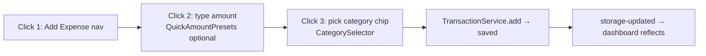

# UI — Components & Views

Related: [styling.md](styling.md) · [../practices.md](../practices.md) · [../architecture/routing-and-views.md](../architecture/routing-and-views.md)

## Conventions

- Functional components returning DOM elements (pattern + example in [../practices.md](../practices.md)).
- Components never fetch directly at module scope; they read services and re-render on `storage-updated` / `categories-updated` / `auth-state-changed` events.
- User input → `textContent`; dialogs (`ConfirmDialog`, `ConflictDialog`, `MobileModal`, `BulkEditDialog`) own focus traps and `aria-modal`.
- Max **500 lines** per file. Larger concerns get subfolders: `components/financial-planning/`, `views/financial-planning/`.

## Views (`src/views/`) — one per route

| View | Route | Size signal |
| --- | --- | --- |
| DashboardView | `dashboard` | biggest view (~45 KB) — stats, filters, transaction list |
| AddView | `add-expense` | small — the 3-click form (see below) |
| EditView | `edit-expense` | edit form, reads `?id=` |
| ReportsView | `reports` | largest file (~51 KB) — Chart.js heavy |
| FinancialPlanningView | `financial-planning` | tabs: Budgets, Forecasts, Goals, Insights, Investments, Overview (sections in `views/financial-planning/`) |
| SettingsView | `settings` | sections: General, DateFormat, Account, DataManagement, BackupRestore, Security, AccountDeletion, Feedback |
| LoginView / LandingView | `login` / `landing` | unauthenticated entry |

## The 3-click form path

Supporting pieces: `utils/form-utils/` (amount-input, category-chips, type-toggle, keyboard, submission, validation, transaction-tags), `QuickAmountPresets`, `DateInput`, `MobileModal`.

## Shared components inventory (src/components/)

- **Navigation/shell:** MobileNavigation, FloatingBackButton, NetworkStatus, LoadingView, ProgressiveEmptyState (+ `utils/enhanced-empty-states.js`)
- **Transaction UI:** TransactionList, TransactionListItem, BulkEditDialog, BudgetProgress/BudgetSummaryCard/BudgetSuggestion/BudgetForm/BudgetInsightsSection
- **Categories:** CategoryCard, CategorySelector, CustomCategoryManager (also a route view)
- **Settings sections:** GeneralSection, DateFormatSection, AccountSection, DataManagementSection, BackupRestoreSection, SecuritySection, AccountDeletionSection, PrivacyControls, ExpandableSection
- **Insights/charts:** ChartRenderer, DashboardStatsCard, InsightCard, NetBalanceChart, InflationTrends, TimePeriodSelector
- **Financial planning:** DataTable, EmergencyFundCard, ForecastCard
- **Feedback:** FeedbackLink, `utils/toast-notifications.js`, `utils/success-feedback.js`

## Invariants

- New page ⇒ new view + route entry in `src/router/routes.js` following the 3-step handler pattern (see [../architecture/routing-and-views.md](../architecture/routing-and-views.md)) + guard update if protected.
- Empty/error states are components, not inline conditionals (ProgressiveEmptyState).
- `updateMobileNavigation(route)` is called by every route handler — don't forget it for mobile parity.
